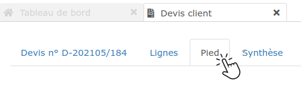
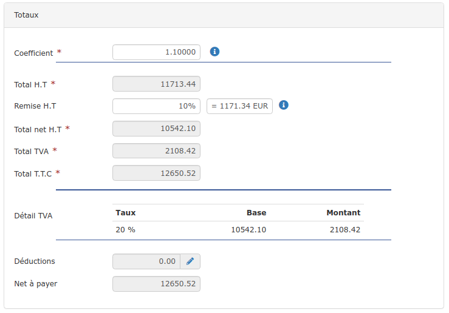
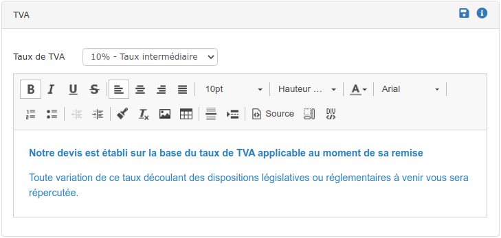
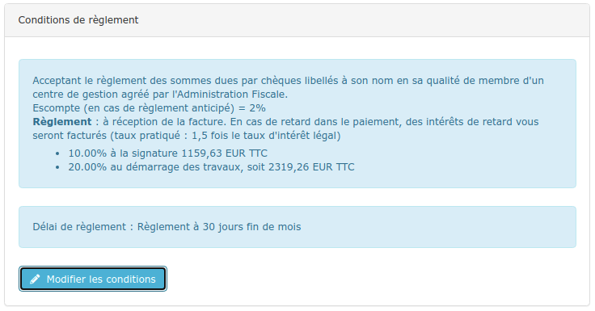
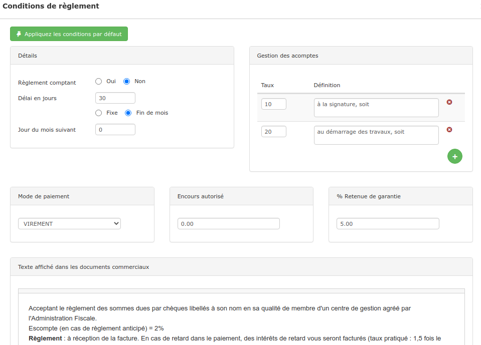
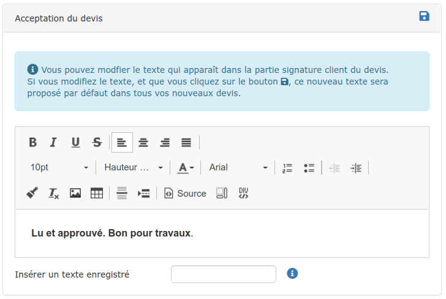

# ➖ Pied du devis

Le pied du devis est composé de 4 sections :

## :digit_one: Les Totaux

Dans ce bloc, vous pourrez modifier : 

### Le Coefficient

Le coefficient permet de majorer le montant du devis, en répartissant la majoration sur chaque ligne.

* Le coefficient 1 représente le prix normal.
*   Un coefficient supérieur à 1.00  augmente les prix

    :arrow_right:_Exemple :_ 1.10 augmentera chaque prix unitaire du devis de 10 %.
*   Un coefficient entre 0.50 et 0.99 diminue les prix

    :arrow_right: _Exemple :_ 0.90 par exemple diminuera chaque prix unitaire du devis de 10 %.

Vous pouvez à tout moment saisir le coefficient 1 pour retrouver les prix initiaux.


* La majoration ne s'applique pas aux prix unitaires fixes (marqués avec un)
* Le coefficient s'applique automatiquement à chaque nouvel ouvrage saisi dans le devis


### La Remise

_Consultez l'article dédié en cliquant _[_ici_](remise.md)_._

### Les Déductions

Saisissez ici vos déductions sur total TTC comme par exemple les [primes énergies](deductions-complementaires/autres-deductions.md) CEE, MaPrimeRénov', etc...


Ne doivent pas être saisis ici :

*   La [retenue de garantie](deductions-complementaires/retenue-de-garantie.md), qui doit être saisie dans le pavé "conditions de règlement" du pied du devis (développé plus bas), pour être totalement gérée par le logiciel.

* Le [compte prorata](deductions-complementaires/le-compte-prorata.md) : Indiquez le pourcentage de déduction à prévoir dans une ligne de commentaire (Onglet "Lignes" du devis), ou bien dans le texte libre de vos conditions de règlement client. La déduction sur total TTC sera saisie lors de la facturation, dans l'onglet "Pied".


## :digit_two:La TVA

Dans le pied du devis, il est possible de choisir le taux de TVA qui sera appliqué à tout le devis.

Si vous modifiez le taux de TVA dans le pied du devis, tous les taux sélectionnés auparavant dans le contenu du devis seront remplacés par le nouveau taux.

Pour certains taux (comme le taux à 0%), une mention légale doit apparaître sur les devis et les factures.

Vous pouvez saisir ou modifier la mention dans la section "TVA" du pied du devis, et l'enregistrer en cliquant sur l'icône :floppy_disk: pour qu'il devienne le nouveau texte par défaut attaché à ce taux de TVA.

****:warning: Si vous modifiez le texte de la mention, pensez à enregistrer votre devis.

__

__[_Cliquez ici_](tva-multiple.md)_ pour apprendre à modifier le taux de TVA ligne par ligne_

## ****:digit_three: **Conditions de règlement**

Les conditions de règlement indiquées au devis sont celles définies par défaut dans votre paramétrage d'entreprise, sauf si vous avez saisi des conditions spécifiques dans la fiche chantier ou la fiche client.

Vous pouvez modifier les conditions de règlement pour ce marché.


Si votre marché fait l'objet d'une [retenue de garantie](deductions-complementaires/retenue-de-garantie.md), saisissez-là dans le cadre dédié.


Cliquez sur "Enregistrer comme conditions par défaut" pour que ces conditions soient à la fois appliquées au devis et définies par défaut.

Pour rétablir les conditions par défaut de votre entreprise, cliquez sur "Appliquer les conditions par défaut".

## :digit_four: Acceptation du devis

Saisissez votre texte d'acceptation client, et mettez-le en forme à l'aide de l'éditeur de texte.

Cliquez sur:floppy_disk:pour définir ce texte par défaut. Vos prochains devis mentionneront ce texte.


:bulb: Insérez un [texte pré-enregistré](../../../les-plus-du-logiciel/bibliotheque-de-textes.md) pour adapter votre texte d'acceptation au type de marché.

