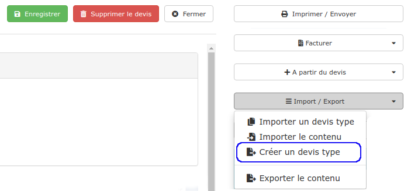
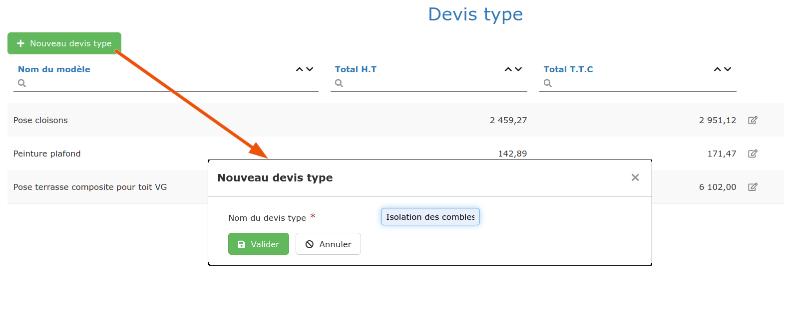
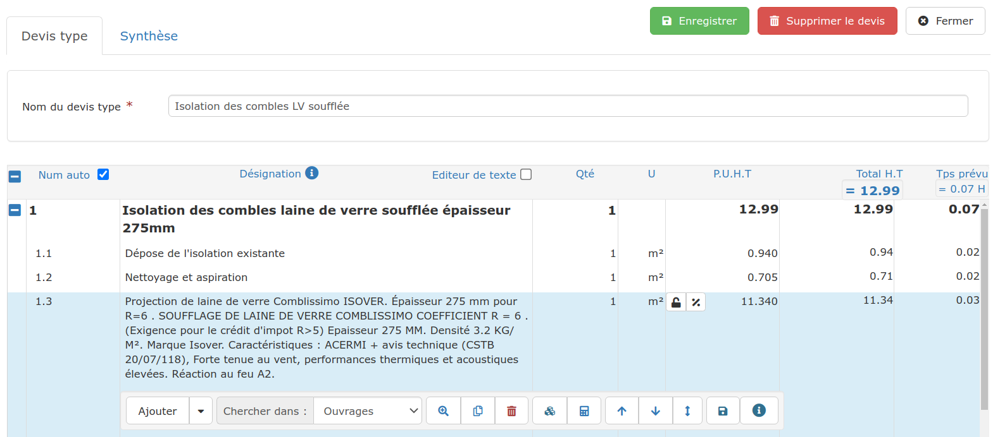
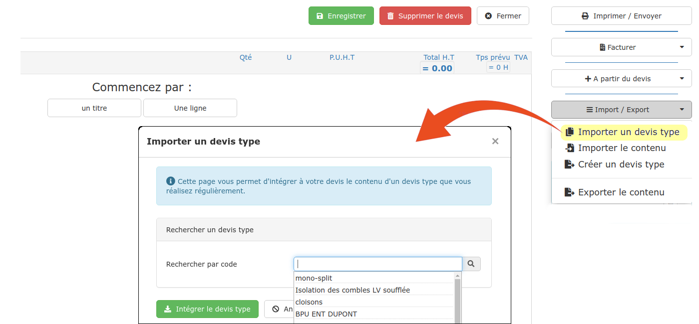
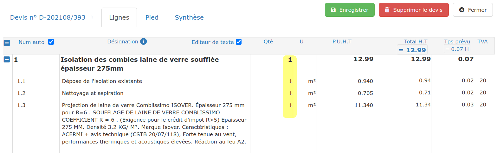

# 📎 Devis-type  &  BPU

## Qu'est ce qu'un devis-type ?

Selon votre activité, vous êtes peut-être amené à réaliser très souvent des devis très similaires, ou à répéter dans tous vos devis toujours les mêmes prestations.

Les devis- type vont vous permettre de pré-enregistrer le contenu d'un devis, et de l'importer tout simplement dans votre devis en cours.

## Qu'est ce qu'un bordereau de prix unitaires (BPU) ?

Il s'agit d'une sorte de devis, mais dont les prix sont définis généralement pour une année entière, à l'unité.


### Astuce

L'astuce du bordereau unitaire est de "fixer" (bloquer) les prix de chaque ligne du devis-type, afin qu'une modification de la bibliothèque ne vienne pas modifier automatiquement un prix fixé pour l'année.

Pour fixer un prix, fermez le cadenas  à côté du prix unitaire en cliquant dessus.


## Créer un devis-type (ou un BPU)

### :digit_one: Depuis un devis existant

*   Cliquez à droite de la page sur "Import / Export"

* Choisissez "Créer un devis type".

### :digit_two: Depuis la liste des devis-type

*   Ouvrez la liste des devis, et cliquez à droite de la page sur "Voir les Devis type"

*   Cliquez sur" Nouveau devis-type"

*   Donnez un nom à votre devis, pour le retrouver facilement (Par exemple : "Isolation des combles LV soufflée", "Remplacement WC", "Installation de chantier", etc...)

*   Validez.

Vous pouvez maintenant saisir les titres, sous-titres et lignes de votre devis, exactement comme un devis classique.

par exemple :

###  :digit_three: Depuis un autre devis-type

Ouvrez le devis-type, et cliquez à droite de la page sur le bouton "Copier le devis type".

## Utiliser vos devis-type

Vos devis-type sont prêts à être utilisés dans vos devis clients :

*   Créez ou ouvrez un devis

* A droite de la page, cliquez sur "Import/Export", puis "Importer un devis type"

*   Sélectionnez le devis-type à importer, le contenu du devis type s'intègre immédiatement

* Il ne reste plus qu'à mettre à jour les quantités :

## Bon à savoir

*   Vous pouvez importer autant de devis-type que vous le souhaitez dans votre devis client

    __
*   La numérotation des lignes du devis-type se met à jour automatiquement au moment de son intégration

* La TVA appliquée aux lignes du devis-type est la TVA générale du devis (indiquée dans le pied du devis).
