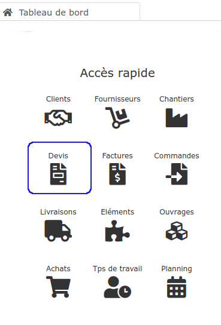

# ➖ Créer un devis

## :digit_one: Créer un devis

*   Ouvrez la liste des devis par le menu "Affaire > Devis", ou en cliquant sur la vignette "Devis" sur le tableau de bord

* Cliquez sur le bouton "Nouveau devis" en haut de la liste.

## :digit_two: Créer ou rechercher un client

Si le client ou le prospect existe déjà dans votre base de données, recherchez-le en tapant quelques lettres, et sélectionnez-le.

Sinon, cliquez sur le bouton "[Créer un nouveau client](../../les-tiers/les-clients/)". Enregistrez votre nouveau client, il sera automatiquement affecté au devis en cours de création.

## :digit_three: Créer ou rechercher un chantier


**Rattacher votre devis à un chantier peut vous permettre de visualiser, depuis la **[**fiche chantier**](../../les-chantiers-1/la-fiche-chantier-en-detail.md#onglet-travaux)**, les coûts prévisionnels, les recettes, et donc de suivre la rentabilité de votre chantier, **[**en temps réel**](../../les-chantiers-1/pilotage-temps-reel.md)**, et même à l'avance !**


Si vous avez sélectionné un client existant, vous pouvez rechercher si le chantier existe déjà pour ce client.

Sinon, [créez un nouveau chantier](../../les-chantiers-1/creer-un-chantier.md) :

* Pour simplifier la saisie, le formulaire est déjà complété des informations client
* Un nom et un identifiant de chantier vous sont automatiquement proposés, vous pouvez les modifier
* **Travaux : **Dans ce dernier champ, saisissez en 2 ou 3 mots le type de travaux que vous allez réaliser (Rénovation intérieure, Façade, Toiture, Construction du garage, Chauffage, Climatisation, .......)

### Créer le devis sans gestion de chantier


**Rattacher votre devis à un chantier peut vous permettre de visualiser, depuis la **[**fiche chantier**](../../les-chantiers-1/la-fiche-chantier-en-detail.md#onglet-travaux)**, les coûts prévisionnels, les recettes, et donc de suivre la rentabilité de votre chantier, **[**en temps réel**](../../les-chantiers-1/pilotage-temps-reel.md)**, et même à l'avance !**


Si vous ne souhaitez pas (ou pas de suite) gérer votre chantier, cliquez directement sur le bouton "Créer le devis sans gestion de chantier".

* Vous pourrez créer et rattacher le chantier au devis plus tard
* Vous pourrez saisir manuellement une adresse chantier dans le devis

### Rattacher un chantier à un devis, plus tard

Il est possible de créer un devis sans créer de fiche chantier, et de décider de créer et rattacher le chantier plus tard, par exemple une fois que le devis a été accepté :

****:point_right: **Le chantier a déjà été créé : **

* Ouvrez le devis à rattacher
* Dans le cadre chantier, cherchez et sélectionnez le chantier existant.

****:point_right:**  Le chantier n'a pas encore été créé :**

* Ouvrez le devis à rattacher
* Cliquez sur le bouton "+" au niveau du cadre "Chantier"
* Complétez le [formulaire](../../les-chantiers-1/creer-un-chantier.md#creer-un-chantier)
* Enregistrez votre devis.

## Comment saisir les lignes de mon devis?

Cliquez [ici](saisir-les-lignes-du-devis/).
