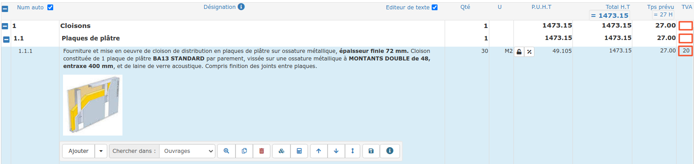

# ➖ TVA multiple

#### Il est possible de définir différents taux de TVA dans le même devis

*   Pour modifier une seule ligne, cliquez sur le taux de TVA en bout de ligne, et choisissez le taux à appliquer.

* Pour modifier toutes les lignes d'un titre, ou d'un sous-titre, cliquez dans la colonne TVA au niveau du titre ou du sous-titre, et choisissez le taux. Il sera appliqué à toutes les lignes de ce titre ou de ce sous-titre en une seule fois.


Lors de la modification du taux de TVA, il vous est possible d'appliquer ce taux à tout le document en sélectionnant l'option proposée.

Un autre moyen d'appliquer le même taux de TVA à tout votre devis consiste à le sélectionner dans le pied du devis. 

:bulb: [**Cliquez ici**](pied-du-devis.md#la-tva)** pour en savoir plus sur les taux de TVA et les mentions légales à associer.**


