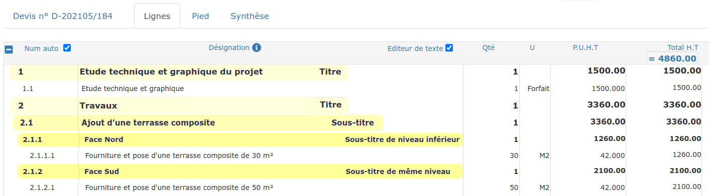
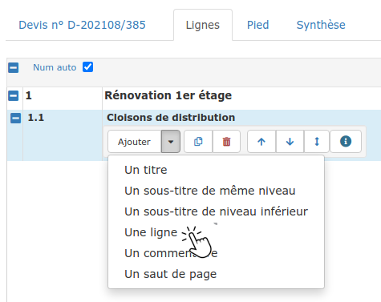
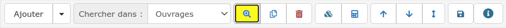

# Lignes du devis

Dans cette page, vous apprendrez à :

* Créer des [titres](lignes-du-devis.md#creer-un-titre) et [sous-titres](lignes-du-devis.md#creer-un-sous-titre) pour organiser votre devis
* **Créer une **[**ligne de chiffrage**](lignes-du-devis.md#creer-une-ligne-de-devis)** (ouvrage, fourniture, main d'oeuvre), et comment la **[**saisir**](lignes-du-devis.md#undefined)****
* Créer une [ligne de commentaire](lignes-du-devis.md#creer-une-ligne-de-commentaire)
* Créer un [saut de page](lignes-du-devis.md#creer-un-saut-de-page)

## :digit\_one: Créer un titre

#### ****

****:point\_right: **Vous venez de créer votre devis : **Cliquez sur l'onglet "Lignes", et choisissez de commencer par "Un titre" :

:point\_right: Vous avez créé un titre_ _("Plâtrerie"_ _par exemple), et vous souhaitez créer un nouveau titre ("Menuiserie") :

.png>)

* Sélectionnez n'importe quelle ligne de votre devis
* Cliquez sur la flèche  du bouton "Ajouter"&#x20;
* Et choisissez **"Un titre".**

Une nouvelle ligne de titre sera ajoutée à la fin de votre devis**.**


**Astuces :**

:point\_right: Vous pourrez [déplacer un titre](le-menu-de-lignes.md#deplacement-de-ligne) et/ou son contenu par la suite.

****:point\_right: **Attention à la numérotation des lignes du devis ! **Le logiciel raisonne de façon logique et ordonnée, mais si on ajoute les titres après des lignes par exemple, la numérotation des lignes peut ne plus être cohérente. **Ne modifiez pas manuellement les numéros de lignes du devis !** Il faut alors simplement réorganiser votre devis : commencez toujours votre devis par un titre, puis si nécessaire, déplacez les titres et lignes pour que leur numérotation reprenne du sens [Comment régler ça ? ](le-menu-de-lignes.md#deplacement-de-ligne)

:point\_right: **Le titre ou sous-titre du devis & facture est à 0 ! **En cliquant sur un titre & sous-titre, vous pourrez voir quelles lignes son total contient (fond bleu). Vous avez dû ajouter ou déplacer le titre après avoir créé les lignes du devis, le titre n'a donc pas encore de contenu (il est seul à avoir ce fond bleu) : il faut ajouter les lignes dans le contenu du titre grâce à la double flèche de déplacement. [Comment régler ça ? ](le-menu-de-lignes.md#deplacement-de-ligne)

****:point\_right:** Le total du titre & sous-titre est incorrect !** Comme juste au dessus, en cliquant sur le titre, vous verrez que toutes les lignes ne sont pas contenues dans le titre (fond bleu). Il vous faut alors ajouter les lignes dans le contenu du titre grâce à la double flèche de déplacement.** **[Comment régler ça ? ](le-menu-de-lignes.md#deplacement-de-ligne)


## :digit\_two: Créer un sous-titre

**A partir d'une ligne de titre**, cliquez simplement sur "Un sous-titre" dans le menu "Ajouter"

_Dans l'exemple ci-dessous : à partir du titre 2 "Travaux" , créer un sous-titre vous permettra de détailler les différents travaux à réaliser ("Réalisation d'une terrasse" par exemple)._

__

A partir de ce sous-titre, dans le menu "Ajouter", vous pourrez choisir :

*   **Un sous-titre de niveau inférieur**

    _Dans l'exemple ci-dessus : Depuis le sous-titre 2.1, créer un sous-titre de niveau inférieur va permettre  de distinguer les zones de travaux (2.1.1 "Face Nord" par exemple)_

    __
*   **Un sous-titre de même niveau**

    _Dans l'exemple ci-dessus : Depuis le sous-titre 2.1.1, créer un sous-titre de même niveau vous permettra de continuer à lister les zones de travaux (2.1.2 "Face Sud")_

__


**Astuces :**

:point\_right: Vous pourrez [déplacer un titre](le-menu-de-lignes.md#deplacement-de-ligne) et/ou son contenu par la suite.

****:point\_right: **Attention à la numérotation des lignes du devis ! **Le logiciel raisonne de façon logique et ordonnée, mais si on ajoute les titres après des lignes par exemple, la numérotation des lignes peut ne plus être cohérente. **Ne modifiez pas manuellement les numéros de lignes du devis !** Il faut alors simplement réorganiser votre devis : commencez toujours votre devis par un titre, puis si nécessaire, déplacez les titres et lignes pour que leur numérotation reprenne du sens [Comment régler ça ? ](le-menu-de-lignes.md#deplacement-de-ligne)

:point\_right: **Le titre ou sous-titre du devis & facture est à 0 ! **En cliquant sur un titre & sous-titre, vous pourrez voir quelles lignes son total contient (fond bleu). Vous avez dû ajouter ou déplacer le titre après avoir créé les lignes du devis, le titre n'a donc pas encore de contenu (il est seul à avoir ce fond bleu) : il faut ajouter les lignes dans le contenu du titre grâce à la double flèche de déplacement. [Comment régler ça ? ](le-menu-de-lignes.md#deplacement-de-ligne)

****:point\_right:** Le total du titre & sous-titre est incorrect !** Comme juste au dessus, en cliquant sur le titre, vous verrez que toutes les lignes ne sont pas contenues dans le titre (fond bleu). Il vous faut alors ajouter les lignes dans le contenu du titre grâce à la double flèche de déplacement.** **[Comment régler ça ? ](le-menu-de-lignes.md#deplacement-de-ligne)


## :digit\_three: Créer une ligne de devis

:point\_right: **Cliquez directement sur le bouton "Ajouter"**, ou bien passez par le menu "Ajouter" et cliquez sur "Une ligne".

Le logiciel crée une nouvelle ligne dans le titre ou le sous-titre actif (fond bleu).

### Comment saisir une ligne du devis ?

3 méthodes s'offrent à vous :

#### &#x20;:one: En texte libre

Saisissez librement votre texte, renseignez ensuite une quantité et un prix unitaire.

Dans une ligne de devis, vous allez pouvoir ajouter :

****:point\_right:** Des ouvrages**, le plus fréquemment. _Exemple :  _"Fourniture et mise en œuvre d'une cloison…", "Mise en peinture d'un plafond…", "Fourniture et pose d'un WC suspendu", …

****:point\_right:** Des fournitures. **_Exemple :  _"Fourniture seule d'une cabine de douche, hors pose et mise en service", …

****:point\_right:** De la main d'oeuvre. **_Exemple :  _"Mise à disposition de main d'oeuvre spécialisée…", ...&#x20;


### À lire :&#x20;

&#x20;

:point\_right: **Vous pouvez de suite enregistrer cet ouvrage dans votre bibliothèque, pour l'insérer plus rapidement dans vos prochains devis. **[Comment faire ?](../../../bibliotheque-de-chiffrage/la-bibliotheque-douvrages/creer-un-ouvrage-dans-votre-bibliotheque.md#depuis-le-devis)

:point\_right: **Découvrez comment chiffrer au plus juste**, en composant vos ouvrages d'éléments (fournitures, main d'oeuvre, etc). [Comment faire ?](../../../bibliotheque-de-chiffrage/la-bibliotheque-douvrages/composer-un-ouvrage.md#depuis-le-devis)

&#x20;

:point\_right: **Découvrez comment estimer automatiquement le temps à consacrer au chantier**. [Comment faire ?](../prevoir-le-temps-passe.md)

****:point\_right: **Correcteur orthographique :**

Le logiciel utilise le correcteur orthographique de votre navigateur.

Lorsqu'un mot est souligné en rouge, cliquez sur ce mot et appuyez simultanément sur la touche **CTRL +  clic droit de votre souris **pour afficher la liste des corrections.


#### :two: En cherchant, depuis le devis, dans vos [bibliothèques](../../../bibliotheque-de-chiffrage/) :

#### :point\_right: [D' Ouvrages](../../../bibliotheque-de-chiffrage/la-bibliotheque-douvrages/) :

* Par défaut, le logiciel est prêt à rechercher dans votre bibliothèque d'ouvrages
* Saisissez simplement les premières lettres de l'identifiant ou du libellé de l'ouvrage à ajouter au devis et sélectionnez-le dans la liste proposée
* La désignation, l'unité, et le prix seront automatiquement affichés.\

#### :point\_right: [D' Éléments](../../../bibliotheque-de-chiffrage/la-bibliotheque-delements.md)** **:&#x20;

* Dans la liste déroulante "Chercher dans" du menu de ligne, sélectionnez :
  * Fournitures
  * Main d'oeuvre
  * Sous-traitance
* Saisissez les premières lettres de l'identifiant ou du libellé de l'élément à ajouter au devis et sélectionnez-le dans la liste proposée

#### :point\_right: [De Textes](../../../../les-plus-du-logiciel/bibliotheque-de-textes.md) :

* Dans la liste déroulante "Chercher dans" du menu de ligne, sélectionnez "Texte"
* Saisissez les premières lettres de l'identifiant ou du libellé du texte à ajouter au devis et sélectionnez-le dans la liste proposée

#### :three: Grâce à la recherche avancée :

*   Cliquez sur la petite loupe dans le menu de ligne, et effectuez votre recherche dans la liste des ouvrages, des éléments, des textes, **mais aussi dans votre **[**bibliothèque BatiChiffrage©**](../../../bibliotheque-de-chiffrage/batichiffrage-c/)**.**

    ****
*   Sélectionnez dans les filtres (en jaune ci-dessous) une bibliothèque et le type d'élément recherché.

*   Ajoutez l'élément au devis en cliquant sur le bouton :heavy\_plus\_sign: en bout de ligne, ou double-cliquez sur la ligne choisie.

## :digit\_four: Créer une ligne de commentaire

Il arrive que vous ayez besoin de saisir un texte explicatif, ou un commentaire dans votre devis. \
Dans ce cas, cliquez sur "Un commentaire" dans le menu du bouton "Ajouter".

Une ligne de commentaire :

* N'a pas de numéro de ligne,
* N'a pas de quantité, d'unité, ni de totaux.

## :digit\_five: Créer un saut de page

Aérez votre devis en utilisant le saut de page.

A l'impression, le logiciel passera à la page suivante en rencontrant la ligne "Saut de page".


**Astuces :**

:point\_right: **Pour aérer votre devis**, sans sauter une page, vous pouvez ajouter une ligne de commentaire vide, après chaque titre, sous-titre ou ligne d'ouvrage.

:point\_right: **Comment changer la police** ou mettre en forme mon texte ? Utilisez l'[éditeur de lignes](mise-en-forme-des-lignes-traitement-de-texte.md).

&#x20;

:point\_right: Une page blanche s'intercale après chaque saut de page ? Cliquez [ici](../../../../faq-aides-trucs-et-astuces/la-panicroom.md#a-chaque-saut-de-page-une-page-blanche-sintercale).


