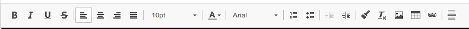

# Mise en forme des lignes & Traitement de texte

Lorsque vous sélectionnez, ou ajoutez une ligne à votre devis, un traitement de texte est immédiatement disponible.

Utilisez cet éditeur de textes pour mettre du texte en gras, changer sa taille, sa couleur, et toutes les autres fonctionnalités habituelles.

Utilisez ce même éditeur pour ajouter une image, un tableau de données ou même un lien hypertexte.


*   La mise en forme d'un titre ou sous-titre s'effectue depuis vos [modèles de document](https://batidocs.gitbook.io/documentation/modeles-de-document).

*   **Pour que toutes vos lignes adoptent une même mise en forme, programmez-la également depuis vos modèles de document.** Une fois programmée, la mise en forme peut toujours être modifiée directement au devis, modification qui sera alors prioritaire à l'envoi/impression du devis.

    __
* Ajouter une image est une fonctionnalité disponible dans le module complémentaire "Galerie d'images" disponible depuis le menu "Administration" > "Ma boutique" ou auprès de votre revendeur.


## Activer & Désactiver l'éditeur de ligne

.png>)

:digit\_one: Cliquez sur le bouton .png>)  à droite de l'entête de colonne "Désignation"

:digit\_two: Cochez ou décochez simplement la case "Éditeur de texte".

