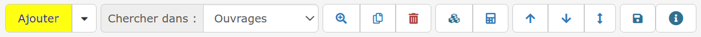
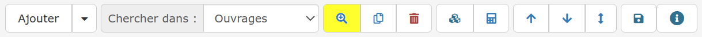
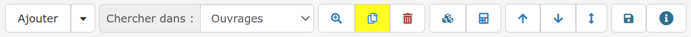
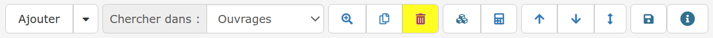
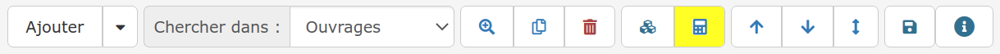
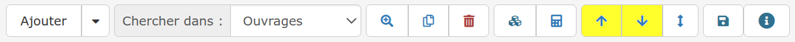
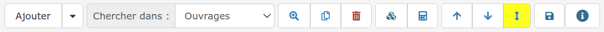
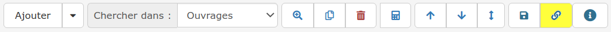

# Le menu de lignes

Apprenez à utiliser chaque fonction de ce menu :

## 1 Ajout rapide d'une ligne d'ouvrage au devis

Cliquez simplement sur "Ajouter" pour qu'une ligne d'ouvrage apparaisse, prête à accueillir votre saisie ou recherche. 

## 2 Ajout de titre, ligne, commentaire, saut de page

Ce menu vous permet d'ajouter :

* [Un titre](saisir-les-lignes-du-devis/titres_devis.md#creer-un-titre) puis un sous-titre
* [Une ligne d'ouvrage](saisir-les-lignes-du-devis/lignes-du-devis.md#creer-une-ligne-de-devis)​, mais il est plus simple de cliquer directement sur le bouton "Ajouter"
* [Un commentaire](saisir-les-lignes-du-devis/lignes-du-devis.md#creer-une-ligne-de-commentaire)
* [Un saut de page](saisir-les-lignes-du-devis/lignes-du-devis.md#creer-un-saut-de-page)

💡 Ajoutez différents types de lignes pour organiser et rendre clair et attractif votre devis.

## 3 Recherche rapide ou avancée

**Ajoutez rapidement** un ouvrage, un élément, un texte à votre devis :

* Dans la liste déroulante du menu de ligne, sélectionnez une bibliothèque de recherche
* Saisissez les premières lettres de l'identifiant ou du libellé de l'élément à ajouter au devis et sélectionnez-le dans la liste proposée

**Recherchez précisément** un ouvrage, un élément, un texte à ajouter au devis, depuis les bibliothèques logiciel ou BatiChiffrage©​.

Apprendre à utiliser la [recherche avancée](saisir-les-lignes-du-devis/methodes-de-saisie.md#grace-a-la-recherche-avancee).

## 
 4 **Copie de ligne**

Copiez à l’identique la ligne sélectionnée, qui se placera alors juste en dessous.

## \*\*\*\*5 **Suppression de ligne, de titre/sous-titre et de son contenu**

Supprimez la ligne sélectionnée.


Si la ligne à supprimer est un titre ou un sous-titre, c’est l’intégralité des lignes qui y sont incluses qui sera supprimée. Pour ne supprimer que le titre, il vous faudra d’abord [déplacer les lignes incluses](le-menu-de-lignes.md#deplacement-de-ligne).


## 6 **Métrage - Calculatrice de quantité avancée**

Calculez efficacement ****vos quantités, surfaces ou volumes par exemple. Enregistrez vos variables et opérations, le logiciel calcule et insère pour vous la quantité à indiquer au devis.

## 7 **Déplacement de ligne**

Deux options s'offrent à vous pour organiser votre devis :

* Déplacez la ligne sélectionnée, vers le haut ou vers le bas, au sein d’un même titre/sous-titre.

* Déplacez la ligne sélectionnée à l’endroit souhaité dans votre document : 
  * avant ou après la ligne sélectionnée, au sein du même titre/sous-titre
  * dans le contenu d’un autre titre/sous-titre pour la comptabiliser 

## 8 **Enregistrement d’un ouvrage dans votre bibliothèque**

**Constituez votre bibliothèque d'ouvrages tout en saisissant vos devis, et devenez rapidement plus efficace dans vos chiffrages.**

Ce bouton permet :

* D'enregistrer un ouvrage saisi manuellement au devis, ou importé. 

  Celui-ci sera ajouté à votre bibliothèque d’ouvrages, et réutilisable / modifiable à l'infini

* D'enregistrer la modification d'un ouvrage ajouté depuis votre bibliothèque \(mise à jour\).

  Les modifications enregistrées seront : libellé, identifiant, unité et prix de vente


Lors de la mise à jour d'un ouvrage, les modifications du prix d'achat et de vente des [éléments composant l'ouvrage](../../bibliotheque-de-chiffrage/la-bibliotheque-douvrages/#la-composition-des-ouvrages) \(fournitures, main d'oeuvre, ...\) ne seront pas enregistrées.

Ainsi, le prix de vente de l'ouvrage mis à jour en bibliothèque ne tient plus compte des éléments qui le composent et donc des marges permettant son chiffrage \(calcul du prix de vente\).

_Pour mettre à jour les données d'un élément, faites-le depuis la_ [_bibliothèque d'éléments_ ](https://app.gitbook.com/@batidocs/s/documentation/~/drafts/-Met51aTnbHK8EAqYE8J/bibliotheque-de-prix/la-bibliotheque-delements)_: Vos ouvrages contenant cet élément seront alors mis à jour et verrons leur prix évoluer, tenant compte de la nouvelle composition \(déboursé, marge\), pour vos futurs ajouts au devis._

\_\_⚠_Les ouvrages ajoutés à vos devis **avant** la mise à jour ne seront pas modifiés._


## \*\*\*\*9 **Récupération des données d’un ouvrage sans modifier son libellé**

Ce bouton est le plus souvent utilisé suite à l’[import de devis ou DPGF.](../import-export.md#import-de-dpgf-et-devis-au-format-excel)

Il permet de conserver le libellé importé ou saisi, tout en y insérant les données de chiffrage et comptables d’un ouvrage présent en bibliothèque.

