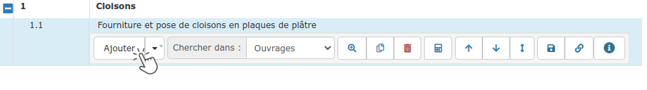
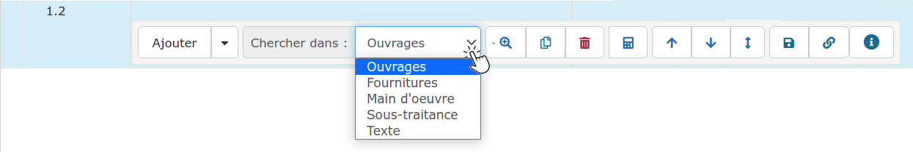
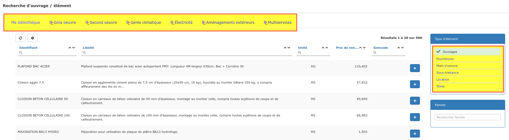

# Méthodes de saisie

Vous pouvez saisir une ligne de devis de 3 manières :

## :digit_one: En texte libre

Saisissez librement votre texte, renseignez ensuite une quantité et un prix unitaire.


### Correcteur orthographique

Le logiciel utilise le correcteur orthographique de votre navigateur.

Lorsqu'un mot est souligné en rouge, cliquez sur ce mot et appuyez simultanément sur la touche **CTRL +  clic droit de votre souris **pour afficher la liste des corrections.


## :digit_two: En cherchant, depuis le devis, dans vos [bibliothèques](../../../bibliotheque-de-chiffrage/)

#### [D' Ouvrages](../../../bibliotheque-de-chiffrage/la-bibliotheque-douvrages/) :

* Par défaut, le logiciel est prêt à rechercher dans votre bibliothèque d'ouvrages
* Saisissez simplement les premières lettres de l'identifiant ou du libellé de l'ouvrage à ajouter au devis et sélectionnez-le dans la liste proposée
* La désignation, l'unité, et le prix seront automatiquement affichés.\

#### [D' Éléments](../../../bibliotheque-de-chiffrage/la-bibliotheque-delements.md)** **: 

* Dans la liste déroulante "Chercher dans" du menu de ligne, sélectionnez :
  * Fournitures
  * Main d'oeuvre
  * Sous-traitance
* Saisissez les premières lettres de l'identifiant ou du libellé de l'élément à ajouter au devis et sélectionnez-le dans la liste proposée

#### [De Textes](../../../../les-plus-du-logiciel/bibliotheque-de-textes.md) :

* Dans la liste déroulante "Chercher dans" du menu de ligne, sélectionnez "Texte"
* Saisissez les premières lettres de l'identifiant ou du libellé du texte à ajouter au devis et sélectionnez-le dans la liste proposée

## :digit_three: Grâce à la recherche avancée

*   Cliquez sur la petite loupe dans le menu de ligne, et effectuez votre recherche dans la liste des ouvrages, des éléments, des textes, **mais aussi dans votre **[**bibliothèque BatiChiffrage©**](../../../bibliotheque-de-chiffrage/batichiffrage-c/)**.**

    ****
*   Sélectionnez dans les filtres (en jaune ci-dessous) une bibliothèque et le type d'élément recherché.

*   Ajoutez l'élément au devis en cliquant sur le bouton :heavy_plus_sign: en bout de ligne, ou double-cliquez sur la ligne choisie.

