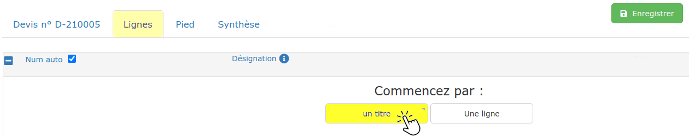

# Titres et sous-titres

## Créer un titre

#### ****

:digit_one:Vous venez de créer votre devis : Cliquez sur l'onglet "Lignes", et choisissez de commencer par "Un titre".

:digit_two: Vous avez créé un titre_ _("Plâtrerie"_ _par exemple), et vous souhaitez créer un nouveau titre ("Menuiserie") :

.png>)

* Sélectionnez n'importe quelle ligne de votre devis
* Cliquez sur la flèche  du bouton "Ajouter" 
* Et choisissez **"Un titre".**

Une nouvelle ligne de titre sera ajoutée à la fin de votre devis**.**


:bulb: Vous pourrez [déplacer un titre](../le-menu-de-lignes.md#deplacement-de-ligne) et/ou son contenu par la suite.


## Créer un sous-titre

:digit_one: A partir d'une ligne de titre, cliquez simplement sur "Un sous-titre" dans le menu "Ajouter"

_Dans l'exemple ci-dessous : à partir du titre 2 "Travaux" , créer un sous-titre vous permettra de détailler les différents travaux à réaliser ("Réalisation d'une terrasse" par exemple)._

__

:digit_two: A partir de ce sous-titre, dans le menu "Ajouter", vous pourrez choisir :

*   **Un sous-titre de niveau inférieur**

    _Dans l'exemple ci-dessus : Depuis le sous-titre 2.1, créer un sous-titre de niveau inférieur va permettre  de distinguer les zones de travaux (2.1.1 "Face Nord" par exemple)_

    __
*   **Un sous-titre de même niveau**

    _Dans l'exemple ci-dessus : Depuis le sous-titre 2.1.1, créer un sous-titre de même niveau vous permettra de continuer à lister les zones de travaux (2.1.2 "Face Sud")_

    __


Comment [déplacer un sous-titre](../le-menu-de-lignes.md#deplacement-de-ligne) et/ou son contenu?



[lignes-du-devis.md](lignes-du-devis.md)

