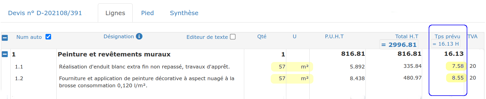
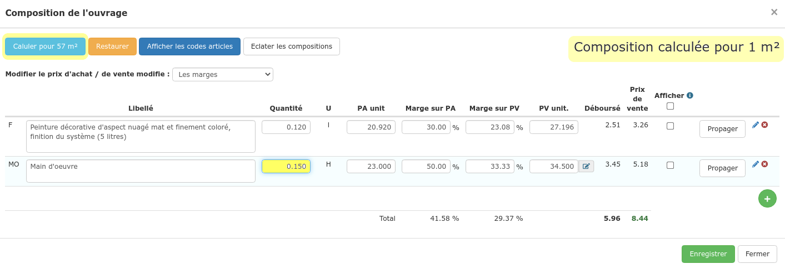

# Prévoir le temps passé sur chantier / Main d'oeuvre

Le temps est déterminant dans le chiffrage d'un devis, c'est la donnée la plus difficile à maîtriser, et souvent la cause d'un chantier déficitaire s'il a été mal estimé.

En réalisant votre devis, vous allez pouvoir estimer le temps nécessaire pour chaque ligne de travaux, et voir le temps prévu pour l'ensemble du chantier au fur et à mesure.

## Préalable

La "bonne méthode" pour réaliser rapidement vos devis est d'utiliser votre bibliothèque d'ouvrages, pour vous éviter de tout ressaisir à chaque fois.

La saisie du temps prévu fonctionne uniquement sur les ouvrages enregistrés.

Si vous n'utilisez pas encore la bibliothèque, [lisez cet article](../bibliotheque-de-chiffrage/la-bibliotheque-douvrages/#depuis-le-devis) pour apprendre à la constituer et la gérer de manière très simple, au fur et à mesure que vous réalisez vos devis.

## Saisir le temps estimé

### Vous utilisez un ouvrage "simple" ?

Vous utilisez pour le moment des ouvrages "simples", c'est à dire simplement un libellé, une unité et un prix de vente, sans le détail de tous les matériaux et de la main d'œuvre nécessaire.

Vos ouvrages sont déjà [enregistrés en bibliothèque](../bibliotheque-de-chiffrage/la-bibliotheque-douvrages/#depuis-la-bibliotheque-douvrages).

Le logiciel vous permet de bénéficier d'un système de composition "rapide", directement dans le devis, pour estimer le temps à consacrer et le montant global des matériaux, et vous permettre de suivre [la rentabilité de vos chantiers](../les-chantiers-1/la-fiche-chantier-en-detail.md#onglet-travaux).

:digit_one: Cliquez sur les 3 petits cubes   dans le menu de ligne, ou bien sur le nombre d'heures prévues

:digit_two: Une composition "par défaut" s'affiche

:digit_three: Renseignez le nombre d'heures (et le montant estimé des dépenses en matériaux), pour que le logiciel calcule le prix de vente de cet ouvrage

__:digit_four:_ _Vérifiez ou modifiez les prix (d'achat et de vente) et/ou les marges

:bulb: Le prix de vente de la main d'œuvre "par défaut" et la marge à appliquer "par défaut", peuvent être paramétrés en cliquant sur le petit crayon  à côté du prix de vente de la main d'oeuvre

:digit_five: Enregistrez. Le temps prévu s'affiche directement au devis.

### Vous utilisez un [ouvrage "composé"](../bibliotheque-de-chiffrage/la-bibliotheque-douvrages/#la-composition-des-ouvrages) ?

Vous avez déjà enregistré votre ouvrage en bibliothèque, en le composant de lignes de matériaux et de main d'oeuvre.

Lorsque vous intégrez cet ouvrage "composé" au devis, le temps prévu (renseigné) dans cet ouvrage s'affiche automatiquement, pour 1 unité (1 m² par exemple).

En modifiant la quantité de la ligne d'ouvrage, le temps se mettra à jour, de telle sorte que le logiciel affiche le temps total à consacrer pour la réalisation de l'ouvrage complet.

Vous pouvez bien sûr modifier ce temps, et même toute votre composition : procédez comme indiqué [ci-dessus](prevoir-le-temps-passe.md#vous-utilisez-un-ouvrage-simple).

### Les avantages de la saisie du temps prévu

La saisie des temps et des dépenses en matériaux prévus vont vous permettre d'alimenter [la synthèse du devis](synthese-du-devis.md), afin de contrôler votre prévisionnel avant de valider le devis.

Selon votre licence, vous pourrez également saisir vos achats et vos temps de main d'oeuvre (et bénéficier de toutes les statistiques de la [page travaux](../les-chantiers-1/la-fiche-chantier-en-detail.md#onglet-travaux)) pour suivre en temps réel la rentabilité de vos chantiers.
