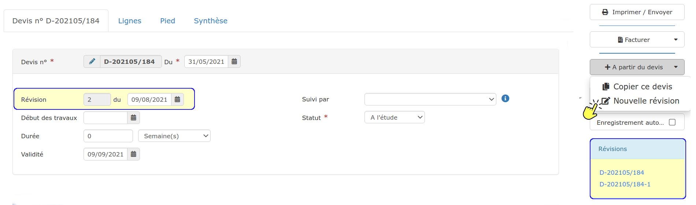

# 📎 Révision et copie de devis

## Révision de devis

Vous êtes souvent amené à proposer à votre client une, deux, trois versions d'un même devis, en modifiant à chaque fois une prestation, une quantité, un prix....

La solution qui paraît la plus simple est de modifier à chaque fois le devis original.\
Mais comment faire si au bout de la 4ème version, le client préfère finalement la première.... que vous avez modifié 3 fois ?

Le logiciel permet de créer des révisions, c'est à dire plusieurs versions différentes d'un même devis.

Ainsi, plutôt que de modifier le devis original, créez autant de révisions que nécessaire, jusqu'à la décision finale de votre client.

:point_right: A partir du devis, cliquez à droite de la page sur "Nouveau devis", et choisissez "Nouvelle révision".

* Une nouvelle révision est immédiatement créée. C'est une copie exacte du devis :
  * La révision porte le même numéro que le devis initial,
  * Un numéro de révision est ajouté automatiquement, et sera clairement affiché sur le devis imprimé.
  * Une date de révision est également ajoutée automatiquement, que vous pouvez bien sur modifier.
  * Dans le petit cadre "Révisions" à droite de la page, vous pouvez facilement naviguer entre l'original et les différentes versions.


*   En acceptant (ou en facturant) une des révisions, toutes les autres révisions passeront automatiquement au statut "refusé".

* Il est déconseillé de supprimer une révision : modifiez-la simplement. En effet, si vous supprimez une révision n°2 par exemple, la nouvelle révision créée par la suite portera le n°3. Si vous êtes dans cette situation, copiez votre devis initial et recréez votre révision n°1 pour établir votre révision n°2.


## Copie de devis

Il est parfois utile de copier un devis existant, pour un nouveau client par exemple, pour des travaux similaires.

:point_right: A partir du devis, cliquez à droite de la page sur "Nouveau devis", et choisissez "Copier ce devis".

*   Le logiciel vous propose :

    * De copier le devis pour le même client et le même chantier. Dans ce cas, il est généralement préférable de créer une révision, comme expliqué [ci-dessus](revision-et-copie-de-devis.md#revision-de-devis).
    * De copier le devis pour un client existant, ou un nouveau client.

*   Contrairement à la révision de devis, la copie crée un nouveau devis avec un nouveau numéro, et totalement indépendant du devis original.

*   Si vous copiez régulièrement un même devis pour différents clients, il est possible de créer un [devis type](devis-type.md).

