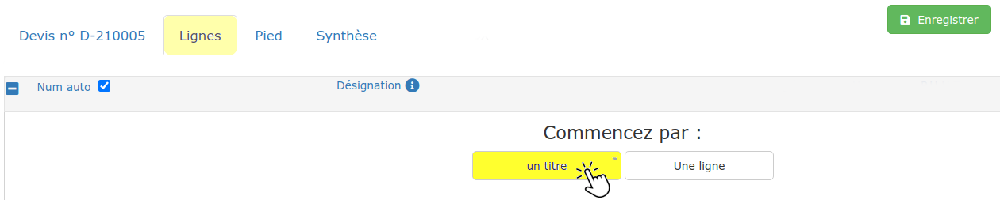
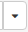
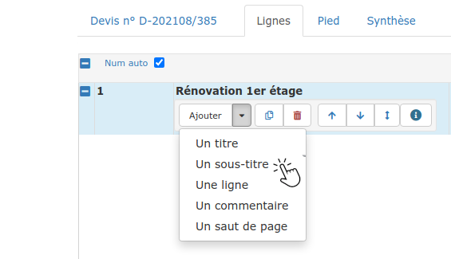
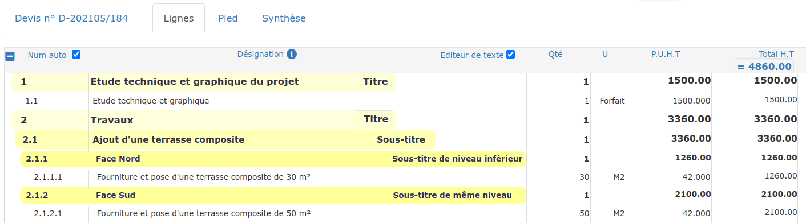
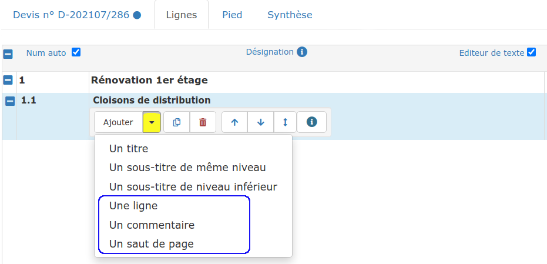
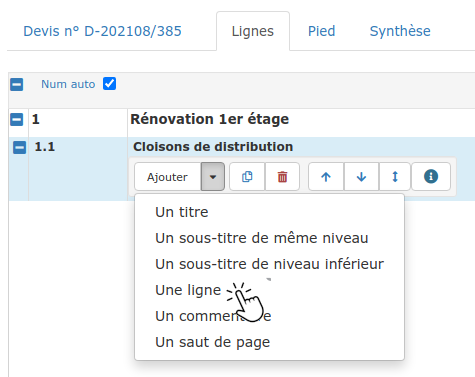
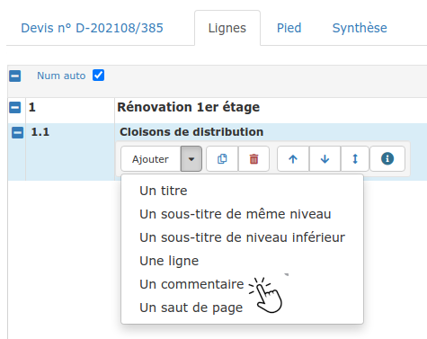
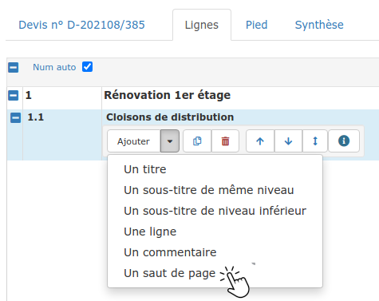

# Lignes du devis

## :digit_one: Créer un titre

#### ****

****:point_right: **Vous venez de créer votre devis : **Cliquez sur l'onglet "Lignes", et choisissez de commencer par "Un titre" :

:point_right: Vous avez créé un titre_ _("Plâtrerie"_ _par exemple), et vous souhaitez créer un nouveau titre ("Menuiserie") :

.png>)

* Sélectionnez n'importe quelle ligne de votre devis
* Cliquez sur la flèche  du bouton "Ajouter" 
* Et choisissez **"Un titre".**

Une nouvelle ligne de titre sera ajoutée à la fin de votre devis**.**


**Astuces & Aides :**

:point_right: Vous pourrez [déplacer un titre](../le-menu-de-lignes.md#deplacement-de-ligne) et/ou son contenu par la suite.

****:point_right: **Attention à la numérotation des lignes du devis ! **Le logiciel raisonne de façon logique et ordonnée, mais si on ajoute les titres après des lignes par exemple, la numérotation des lignes peut ne plus être cohérente. Il faut alors simplement réorganiser votre devis : commencez toujours votre devis par un titre, puis si nécessaire, déplacez-les pour que la numérotation des lignes reprenne du sens [Comment régler ça ? ](../le-menu-de-lignes.md#deplacement-de-ligne)

:point_right: **Le titre ou sous-titre du devis & facture est à 0 ! **En cliquant sur un titre & sous-titre, vous pourrez voir quelles lignes son total contient (fond bleu). Vous avez dû ajouter ou déplacer le titre après avoir créé les lignes du devis, le titre n'a donc pas encore de contenu (il est seul à avoir ce fond bleu) : il faut ajouter les lignes dans le contenu du titre grâce à la double flèche de déplacement. [Comment régler ça ? ](../le-menu-de-lignes.md#deplacement-de-ligne)

****:point_right:** Le total du titre & sous-titre est incorrect !** Comme juste au dessus, en cliquant sur le titre, vous verrez que toutes les lignes ne sont pas contenues dans le titre (fond bleu). Il vous faut alors ajouter les lignes dans le contenu du titre grâce à la double flèche de déplacement.** **[Comment régler ça ? ](../le-menu-de-lignes.md#deplacement-de-ligne)


## Créer un sous-titre

**A partir d'une ligne de titre**, cliquez simplement sur "Un sous-titre" dans le menu "Ajouter"

_Dans l'exemple ci-dessous : à partir du titre 2 "Travaux" , créer un sous-titre vous permettra de détailler les différents travaux à réaliser ("Réalisation d'une terrasse" par exemple)._

__

A partir de ce sous-titre, dans le menu "Ajouter", vous pourrez choisir :

*   **Un sous-titre de niveau inférieur**

    _Dans l'exemple ci-dessus : Depuis le sous-titre 2.1, créer un sous-titre de niveau inférieur va permettre  de distinguer les zones de travaux (2.1.1 "Face Nord" par exemple)_

    __
*   **Un sous-titre de même niveau**

    _Dans l'exemple ci-dessus : Depuis le sous-titre 2.1.1, créer un sous-titre de même niveau vous permettra de continuer à lister les zones de travaux (2.1.2 "Face Sud")_

    __


Comment [déplacer un sous-titre](../le-menu-de-lignes.md#deplacement-de-ligne) et/ou son contenu?


Vous avez créé votre devis, vous avez [créé un titre](titres_devis.md#creer-un-titre), peut-être [un sous-titre](titres_devis.md#creer-un-sous-titre), voici comment ajouter une ligne au devis :

## :digit_one: Créer une ligne de devis

:point_right: **Cliquez directement sur le bouton "Ajouter"**, ou bien passez par le menu "Ajouter" et cliquez sur "Une ligne".

Le logiciel crée une nouvelle ligne dans le titre ou le sous-titre actif (fond bleu).


Consultez les [méthodes de saisie](../methodes-de-saisie.md) pour plus de rapidité dans vos chiffrages.


### Dans une ligne de devis

*   **Des ouvrages**, le plus fréquemment

    _Exemple :  _"Fourniture et mise en œuvre d'une cloison…", "Mise en peinture d'un plafond…", "Fourniture et pose d'un WC suspendu", …

    :point_right: Découvrez comment chiffrer au mieux, en [composant vos ouvrages](../../../../../bibliotheque-de-chiffrage/la-bibliotheque-douvrages/composer-un-ouvrage.md).

    #### :point_right: Découvrez comment chiffrer au mieux, en [composant vos ouvrages](../../../../../bibliotheque-de-chiffrage/la-bibliotheque-douvrages/composer-un-ouvrage.md).

*   **Des fournitures**

    _Exemple :  _"Fourniture seule d'une cabine de douche, hors pose et mise en service", …

*   **De la main d'oeuvre**

    _Exemple :  _"Mise à disposition de main d'oeuvre spécialisée…", ... 

    :point_right: **Découvrez comment **[**estimer automatiquement le temps à consacrer au chantier**](../../../prevoir-le-temps-passe.md)**.**

## :digit_two: Créer une ligne de commentaire

Il arrive que vous ayez besoin de saisir un texte explicatif, ou un commentaire dans votre devis. \
Dans ce cas, cliquez sur "Un commentaire" dans le menu du bouton "Ajouter".

Une ligne de commentaire :

* N'a pas de numéro de ligne,
* N'a pas de quantité, d'unité, ni de totaux.

## :digit_three: Créer un saut de page

Aérez votre devis en utilisant le saut de page.

A l'impression, le logiciel passera à la page suivante en rencontrant la ligne "Saut de page".


*   Pour aérer votre devis, vous pouvez ajouter une ligne de commentaire vide, après chaque titre, sous-titre ou ligne d'ouvrage.

* Comment utiliser l'[éditeur de lignes ](../mise-en-forme-des-lignes-traitement-de-texte.md)?


