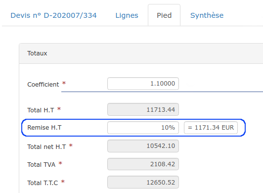
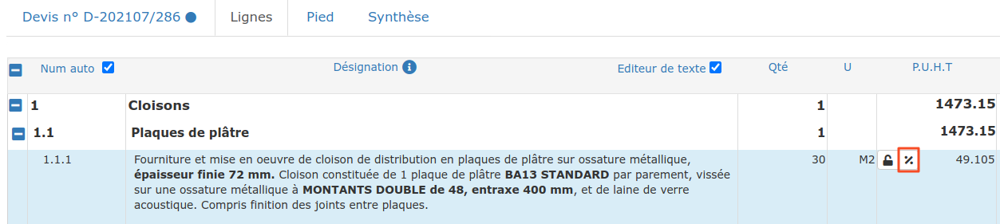
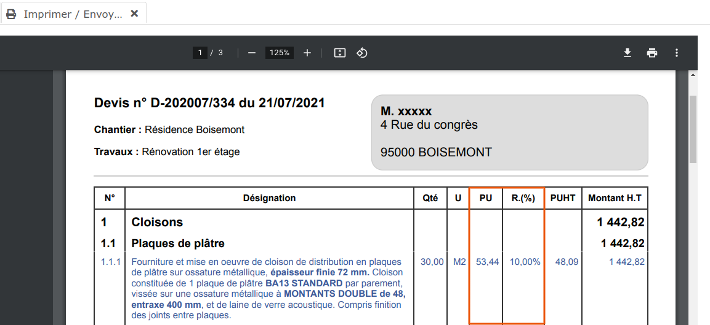

# 📎 Remises

## :digit_one: Remise globale

Dans la case "Remise H.T" du pied du devis, vous pourrez saisir :

* Un montant, _par exemple 300_
* Un taux, en terminant votre saisie par le caractère % . Le montant de remise sera calculé automatiquement.


Cette remise sera visible par le client dans le bloc des totaux, au pied du devis.


## :digit_two: Remise par ligne

* Cliquez sur le symboleà gauche du prix unitaire
*   Saisissez le taux de remise à appliquer,_10% par exemple_, ou bien directement le prix unitaire remisé.

Si vous utilisez nos modèles proposés par défaut pour imprimer/envoyer vos devis, une colonne "Prix unitaire" et "Remise" seront automatiquement affichées pour mettre en valeur cette remise accordée.

:arrow_right: Vous pourrez modifier cet affichage en [personnalisant vos modèles de document](../../modeles-de-document.md).
