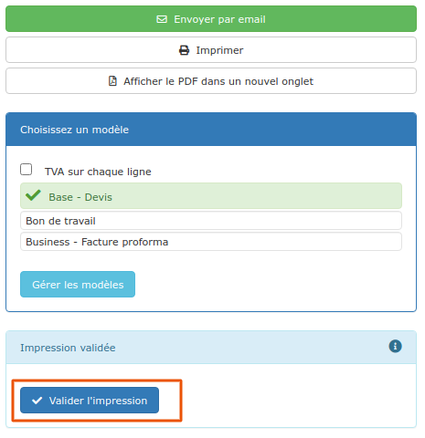

# 📎 Statut des devis

Il existe 2 types de statuts pour les devis :

## :digit\_one: Le statut "Commercial" du devis

* ******À l'étude : **Le devis est en cours de réalisation et de chiffrage, il n'a pas encore été transmis au client

* **** **En Attente** : Le devis est terminé, et il a été transmis au client, en attente de sa décision.
  * Le devis passe automatiquement en statut "En attente" s'il est envoyé par mail
  * Si vous l'imprimez pour l'envoyer par courrier, ou le remettre en main propre à votre client, ou si vous le téléchargez sur votre ordinateur pour l'envoyer par votre système de mail habituel, n'oubliez pas de cliquer sur "**Valider l'impression**", pour indiquer au logiciel que le devis a bien été remis au client, et qu'il passe donc en statut "En attente".

* **** **Accepté** : le devis a été accepté par votre client.
  *   Nous vous suggérons de scanner le devis signé, et de déposer le scan sur la [ProGBox](../../les-plus-du-logiciel/progbox-archivage-de-documents.md) de votre devis, permettant de le retrouver très facilement, depuis le devis, la fiche client, ou encore la fiche chantier. [_En savoir plus_](../../les-plus-du-logiciel/progbox-archivage-de-documents.md#archivage-de-tous-vos-documents)_._

* **** **Refusé** : le devis a malheureusement été refusé par votre client.
  * Dans le cas de [révisions](revision-et-copie-de-devis.md#revision-de-devis) (versions) d'un devis, le fait d'accepter un des devis de la série passe tous les autres en statut "Refusé" automatiquement.
  * Il est possible de supprimer un devis "Refusé", mais cela faussera vos statistiques sur le tableau de bord.


**Un devis "En attente", "Accepté" ou "Refusé" n'est pas directement modifiable, vous devez d'abord le repasser en statut "A l'étude".**

**De manière générale, si vous devez modifier un devis, utilisez plutôt les **[**révisions**](revision-et-copie-de-devis.md#revision-de-devis)**, permettant de conserver tout l'historique des différentes versions d'un même devis.**


## :digit\_two: Le statut "Travaux" d'un devis

Tant qu'un devis est en statut "A l'étude" ou "En attente", le logiciel considère que les travaux n'ont pas commencé, et aucune mention particulière n'est affichée.

Mais dès que vous passez le devis en statut "Accepté", un "Statut de travaux" apparaît sur l'entête du devis:

* &#x20;A la création d'une facture d'acompte, les travaux seront toujours au statut "non commencés", cliquez [ici](../les-factures/la-facture-dacompte.md#ne-pas-confondre-facture-dacompte-et-facture-davancement-situation-de-travaux) pour savoir pourquoi.
* A la création d'une [situation de travaux](../les-factures/situation-de-travaux.md), le statut du devis passera automatiquement en "Travaux en cours".
* Si vous créez une facture de fin de travaux, le statut du devis passera automatiquement en "Travaux terminés".


Modifier manuellement le statut "travaux" du devis ne modifiera pas le statut des travaux du chantier.

