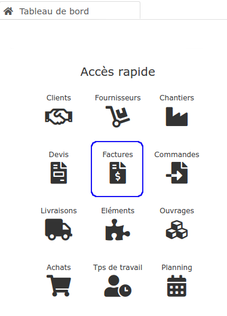

# 📑 Factures

### **Grâce au logiciel, gérez très simplement tous les types de facture du bâtiment :**


[la-facture-dacompte.md](la-facture-dacompte.md)



[situation-de-travaux.md](situation-de-travaux.md)



[facture-directe.md](facture-directe.md)



[realiser-un-avoir.md](realiser-un-avoir.md)


****


### **Mentions obligatoires sur une facture :**

France : [https://www.service-public.fr/professionnels-entreprises/vosdroits/F31808](https://www.service-public.fr/professionnels-entreprises/vosdroits/F31808)


