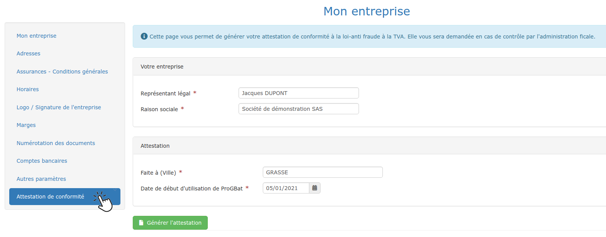

# 📎 Conformité à la "Loi anti-fraude à la TVA"

## Un bref rappel de la loi (pour la France)

*   **Inaltérabilité :** Toute facture ou règlement validé ne pourra plus être modifié ou supprimé

*   **Sécurisation :** Un dispositif de contrôle électronique des documents permettra de garantir qu'aucune donnée n'a été modifiée frauduleusement et ultérieurement à la validation

*   **Conservation :** Les factures et règlements saisis sont enregistrés et conservés dans votre base de données personnelle et sécurisée, automatiquement archivée toutes les 24 heures

*   **Archivage :** Les données de facturation et de règlement doivent être clôturées au maximum chaque année, et archivées pendant 6 ans, durée de la prescription fiscale.

Consultez le texte de loi [en cliquant ici.](http://bofip.impots.gouv.fr/bofip/10691-PGP.html)

## Attestation de conformité (pour la France)


**Vous devez obligatoirement détenir une attestation de conformité du logiciel, au risque d'une forte amende dans le cas contraire.**


:digit_one:** **Ouvrez le menu "Administration > Mon Entreprise"

:digit_two: Cliquez sur la section "Attestation de conformité"

:digit_three: Vérifiez et mettez à jour si besoin les informations affichées

:digit_four: Générez l'attestation

:digit_five: Imprimez, signez, et conservez l'attestation afin de la produire en cas de contrôle de l'administration fiscale.

## Application de la loi dans le logiciel


L'application de la loi a très peu d'incidences sur votre utilisation du logiciel.


### Factures

*   Chaque nouvelle facture est créée en mode **provisoire**, que vous pouvez modifier ou supprimer sans aucune contrainte

*   Pour valider une facture, cliquez sur le bouton "Finaliser la facture"

*   Elle devient automatiquement une **facture réelle, inaltérable et sécurisée**

    ****
*   Une facture validée ne pourra plus être supprimée. C'est la **condition d'inaltérabilité** prévue par la loi

*   Une facture validée pourra être modifiée dans certains cas, mais toutes les modifications apportées sont enregistrées, historisées et archivées, conservant ainsi l'inaltérabilité et la traçabilité de la facture originale

*   Une facture validée est sécurisée par un cryptage électronique, c'est la **condition de sécurisation** prévue par la loi.

### Règlements

*   Lorsque vous saisissez un règlement, il est immédiatement **inaltérable et sécurisé**.

### Conservation et archivage

*   Votre base de donnée est mise à jour en temps réel, et archivée chaque nuit sur des serveurs d'archivage sécurisés. C'est la **condition de conservation** prévue par la loi

*   **Vous devrez réaliser chaque année une clôture de facturation et règlements**

    :point_right: Assurez-vous que toutes vos factures et règlements sont saisis pour la période à clôturer

    :point_right: Ouvrez le menu "Gestion > Clôture d'exercice", et créez la clôture

    :point_right: Un fichier d'archive fiscale sera créé, que vous devrez remettre à l'administration fiscale, à leur demande, en cas de contrôle fiscal.

* Cette clôture sera archivée sur nos serveurs pendant 6 ans. C'est la **condition d'archivage** prévue par la loi.

##

****
