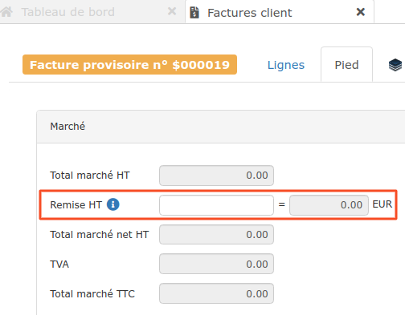
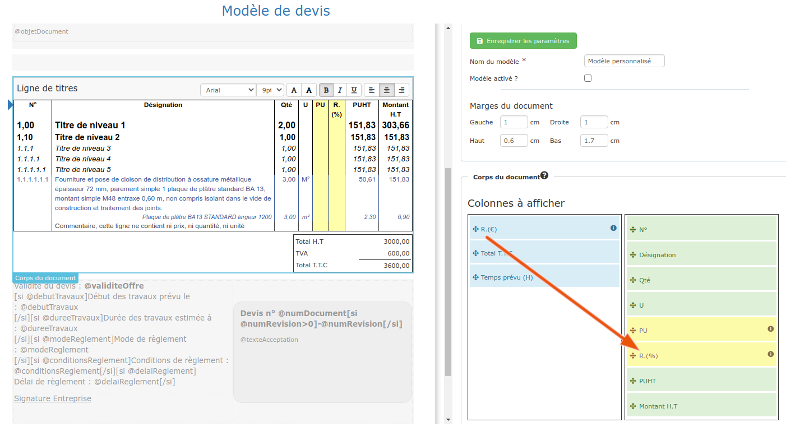
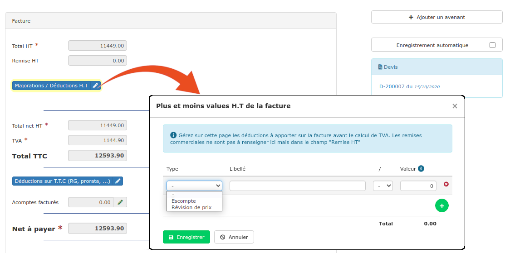
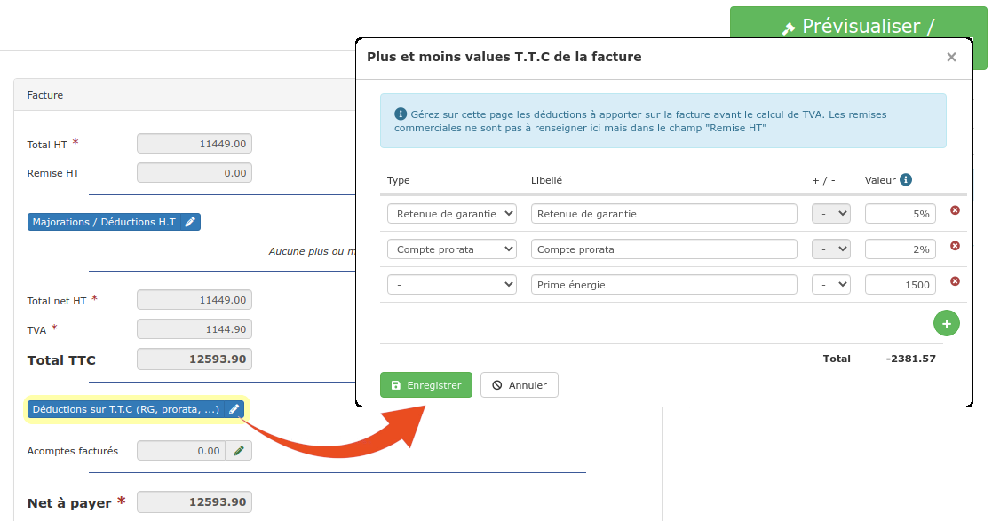
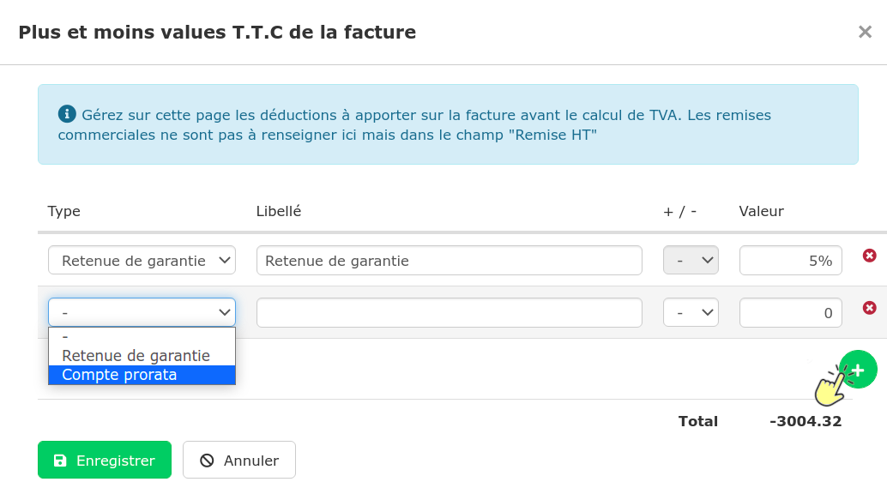

# 📎 Remise, Déduction & Majoration

## Remises

**Il est préférable d'indiquer votre **[**remise dès le devis**](../les-devis/les-indispensables-du-devis/remise.md), car c'est le devis qui expose et fait accepter les termes du marché à votre client.


**Si votre remise correspond à des travaux qui ne seront pas effectués, établissez alors un **[**avenant**](https://app.gitbook.com/@batidocs/s/documentation/\~/drafts/-Menm1wOmfmOcAl2vjRd/les-avenants)**. **Celui-ci modifiera le montant du marché et rendra plus cohérente votre facturation, pour votre client mais aussi pour votre comptabilité.


Il est possible d'appliquer une remise à votre client de 2 manières :

### :digit\_one: Remise globale

Saisissez dans la case "Remise H.T" dans l'onglet "Pied" de facture :

* Un montant, par exemple 300
* Un taux, en terminant votre saisie par le caractère "%", le montant de remise sera alors calculé automatiquement.


Cette remise sera visible par le client dans le bloc des totaux, au pied de la facture.


### :digit\_two: Remise par ligne

.png>)

* Cliquez sur le symbole "%" à gauche du prix unitaire
* Saisissez le taux de remise à appliquer, ou bien directement le prix unitaire remisé

Si vous utilisez nos modèles de document proposés par défaut pour imprimer/envoyer vos factures, une colonne de prix unitaire initial et de remise en % seront alors automatiquement affichées pour mettre en valeur cette remise accordée. Vous pourrez modifier cet affichage en personnalisant vos [modèles de document](https://app.gitbook.com/@batidocs/s/documentation/\~/drafts/-Men\_pFAhyDLxf6Dn7SY/modeles-de-document) :

## Déductions & Majorations

:bulb: Pensez à réaliser le [paramétrage comptable](../exports-comptables/parametrage-1/les-comptes-complementaires.md) de ces déductions et majorations.

### :digit\_one: Révision de prix des marchés publics

* Rendez-vous dans l'onglet "Pied" de votre facture
* Cliquez sur le bouton "Majorations / déductions **H.T**"
* Cliquez sur le boutonpour créer une nouvelle ligne &#x20;
* Choisissez "Révision de prix" dans le menu déroulant. Par défaut, le signe "+" sera appliqué
* Saisissez le taux de révision, en ajoutant "%" à la fin (1.02487% par exemple)
* Enregistrez.

Le montant de la majoration est calculé, et les totaux de la facture mis à jour.

### :digit\_two: Escompte

* Rendez-vous dans l'onglet "Pied" de votre facture
* Cliquez sur le bouton "Majorations / déductions **H.T**"
* Cliquez sur le boutonpour créer une nouvelle ligne
* Sélectionnez "Escompte" dans le menu déroulant. Par défaut, le signe "-" sera appliqué
* Saisissez l'escompte à appliquer, pour appliquer un taux, terminez la saisie par le symbole "%"

### :digit\_three: Retenue de garantie

****:information\_source: **Le logiciel permet une gestion complète des retenues de garantie, **cliquez [ici ](../../les-plus-du-logiciel/retenue-de-garantie.md#gerer-les-retenues-de-garantie)pour en savoir plus.

:bulb: [Saisir la retenue de garantie depuis le devis](../les-devis/les-indispensables-du-devis/remise.md#retenue-de-garantie) permet d'automatiser la déduction sur facture, aucun risque de l'oublier au moment de facturer !&#x20;

* Dans le pied de la facture, cliquez sur le bouton "Déductions sur TTC"
* Cliquez sur le bouton  pour créer une nouvelle ligne
* Choisissez "Retenue de garantie", par défaut, une déduction de 5% sera créée
* Vous pourrez modifier le taux de retenue de garantie en terminant la saisie par le symbole "%"
* Enregistrez.

La retenue de garantie est automatiquement calculée et déduite du total TTC de la facture. Le "net à payer" de la facture devient alors inférieur au total TTC. C'est ce "net à payer" que le client devra régler.


*   **La retenue de garantie ne s'applique en aucun cas sur le total HT** de la facture, mais bien sur le TTC, conformément à l'[Annexe D du Code Général des Collectivités Territoriales](https://www.legifrance.gouv.fr/affichCodeArticle.do;jsessionid=563192E315E3A72832B0FE5032306000.tpdila08v\_3?idArticle=LEGIARTI000031892441\&cidTexte=LEGITEXT000006070633\&dateTexte=20161025)

    ****
*   **En cas de révision de prix**, la retenue de garantie sera calculée sur le montant TTC de la facture AVANT application de la révision de prix.

*   **Retenue de garantie sur facture d'acompte : **

    Il n'est pas possible d'appliquer une retenue de garantie ou du compte prorata à une facture d'acompte, simplement parce qu'aucun travaux n'est facturé, et que ces 2 déductions s'appliquent uniquement sur les travaux, pas sur les mouvements financiers.

    L'acompte n'est en fait que le reçu justifiant d'une somme versée avant le démarrage des travaux, comme si le client avait payé une partie de la première situation de travaux à l'avance.

    Par définition, vous n'avez pas encore réalisé de travaux à garantir, et n'avez pas utilisé les moyens mis à sa disposition au titre du compte prorata, il n'y a donc aucune justification à les imputer à une facture d'acompte.

    De ce fait, le logiciel ne permet pas cette imputation.

    Si votre client souhaite réellement appliquer une retenue de garantie et un compte prorata à cette facture, il ne faut pas faire de facture d'acompte, mais une première situation, avec en avancement global, le montant de l'acompte.



****

### :digit\_four: Compte prorata

:one: Au devis

Indiquez textuellement le pourcentage de déduction à prévoir :

* Dans une [ligne de commentaire](../les-devis/les-indispensables-du-devis/saisir-les-lignes-du-devis/lignes-du-devis.md#creer-une-ligne-de-commentaire) (Onglet "Lignes")
*   Ou bien dans le texte libre de vos [conditions de règlement](../les-devis/les-indispensables-du-devis/pied-du-devis.md#conditions-de-reglement) (Onglet "Pied").

:two: Dans la facture

C'est dans la facture que la déduction doit être concrètement saisie :&#x20;

* Dans l'onglet "Pied" de la facture, cliquez sur le bouton "Déductions sur TTC"
* Cliquez sur le bouton  pour créer une nouvelle ligne

* Choisissez "Compte prorata"**. **_Par défaut, le signe "-" sera appliqué_
* Saisissez le taux à appliquer, en ajoutant "%" à la fin (2% par exemple)
* Enregistrez.

Le montant de la déduction est calculé, et les totaux de la facture mis à jour.


*   **En cas de révision de prix**, le compte prorata sera calculé sur le montant TTC de la facture AVANT application de la révision de prix.

*   Gestionnaire du compte prorata :

    Vous avez été nommé gestionnaire du compte prorata pour un marché.

    La gestion du compte prorata exige un outil dédié, en plus d'un logiciel de facturation.


****

### :digit\_five: Prime énergie

Cliquez [ici](deductions-et-majorations.md#autres-deductions).

####

### :digit\_six: Paiement direct sous-traitants

* Dans le pied de la facture, cliquez sur le bouton "Déductions sur TTC"
* Ajoutez une déduction, en cliquant sur le bouton vert 
* Saisissez un libellé, par exemple : "Paiement direct entreprise DUPONT facture 123456 du jj/mm/aa"

