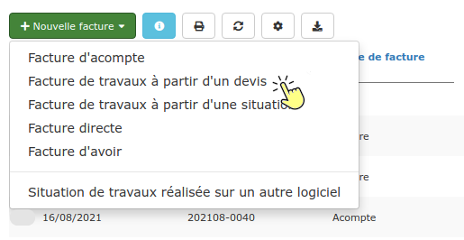
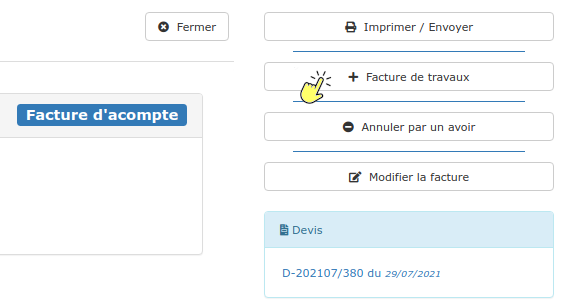

# ▪ Facture de travaux

Une facture de travaux est une facture unique, émise à partir du devis ou de la facture d'acompte, lorsque les travaux sont terminés. C'est une facture à 100 % d'avancement.


**Pour établir des factures intermédiaires, au fil de l'avancement des travaux, c'est alors une facture de situation qu'il vous faut faire : cliquez **[**ici**](situation-de-travaux.md)**.**


## Créer une facture de travaux

:digit\_one: 3 possibilités s'offrent à vous :

:point\_right: A partir d'un devis : Cliquez sur le bouton "Facturer" à droite de la page, puis "Facture de travaux"

.png>)

:point\_right: Ou bien, ouvrez la liste des factures, cliquez sur le bouton "Nouvelle facture", puis "Facture de travaux à partir d'un devis". Recherchez le devis à facturer, et validez.

:point\_right: Ou encore, ouvrez la facture d'acompte, et cliquez sur le bouton "Facture de travaux" à droite de la page

:digit\_two: Ouvrez l'onglet "Lignes" de la facture

Dans la colonne(pourcentage d'avancement), vous remarquerez que tous les avancements sont à 100, donc 100%. Si vous définissez un avancement inférieur à 100, le logiciel comptabilisera cette facture comme une première [situation de travaux](situation-de-travaux.md).

:digit\_three: Vérifiez les données de l'onglet "Pied" de votre facture, modifiez / ajoutez des données **uniquement **si nécessaire (saisir d'une déduction pour [compte prorata](broken-reference), par exemple).


**Si vous avez réalisé une  ou plusieurs factures d'acompte**, la totalité de l'acompte sera déduite de cette facture de travaux.


