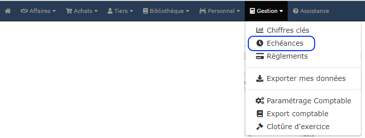

# 📎 Factures impayées

## Liste des factures partiellement ou non réglées

Ouvrez le menu "Gestion > Échéances", ou bien directement sur votre tableau de bord, sur le pavé "Échéances" :&#x20;

.png>)

* Le premier onglet affiche la liste des factures client partiellement ou non réglées
* La colonne Échéance vous permet de contrôler si le paiement d'une facture est en retard
* La date d'échéance des factures en retard est affichée en rouge pour les mettre en évidence


:bulb: Il est conseillé de trier la colonne échéance par ordre croissant. Ainsi, toutes les factures en retard seront affichées en début de liste.


## Envoyer un courrier de relance

:digit\_one: Cliquez sur l'imprimanteen bout de ligne de la facture à relancer

:digit\_two: Un courrier de relance est automatiquement créé. Choisissez alors le modèle le plus adapté parmi la liste proposée :&#x20;

* ** Facture en retard**
* ** Factures chantier en retard**
* &#x20;Relevé de compte chantier
* &#x20;**Factures client en retard**
* &#x20;Relevé de compte client

Comme tous les modèles, les courriers de relance proposés par défaut est totalement [personnalisable](../modeles-de-document.md).

:digit\_three: Imprimez ou envoyez par email ce courrier, accompagné si besoin de pièces jointes

:bulb: Sur votre liste de devis, factures, commandes, et échéances, un document envoyé par mail sera immédiatement identifié : &#x20;

L'icôneen bout de ligne passera au bleu &#x20;

## Relevés de compte

Le logiciel permet d'imprimer un relevé de compte client, ou un relevé de compte chantier.

Procédez comme pour un courrier de relance : Cliquez [ici](factures-impayees.md#envoyer-un-courrier-de-relance).

