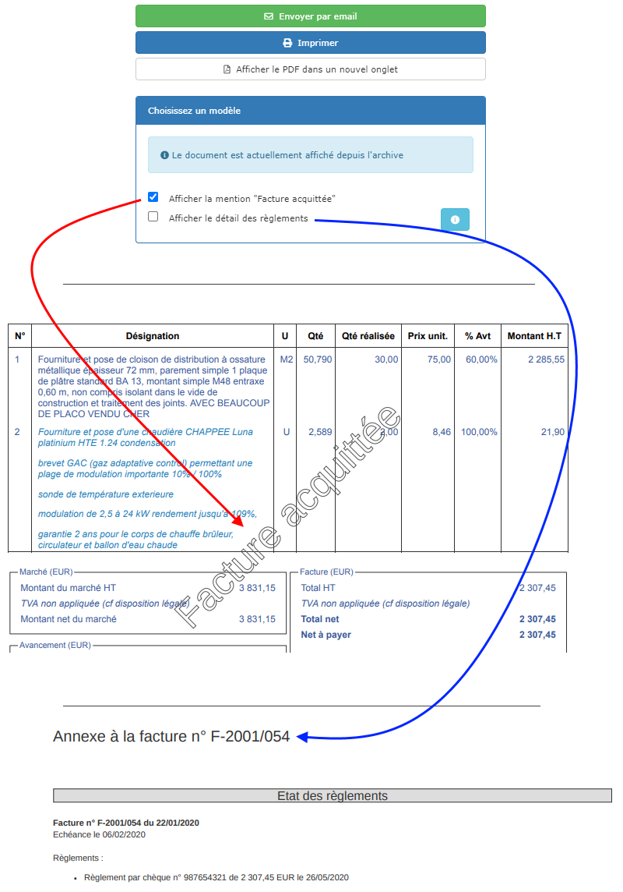

# Imprimer une facture

L'impression d'une facture est un peu différente des autres documents.

## Imprimer une facture en mode provisoire \(brouillon\).

Une facture est toujours créée en mode provisoire, comme [expliqué ici](valider-une-facture.md#la-facture-provisoire).

A l'impression, la facture comporte un filigrane "Facture provisoire", conformément à la réglementation.  
Cette facture peut être envoyée par mail ou imprimée, par exemple pour faire valider des avancement par la maîtrise d'oeuvre, avant de valider définitivement la facture.

Tant que la facture est en mode provisoire, vous pouvez librement choisir le modèle de facture à utiliser, et ajouter l'option "Avec récapitulatif" si vous le souhaitez.


**En mode provisoire, le numéro et la date de la facture ne s'affichent pas sur le document pdf.**


## Imprimer une facture "validée".

Dès que vous validerez une facture \(bouton "Finaliser la facture\), elle sera réaffichée sans la mention provisoire, et automatiquement [archivée dans la ProGBox](../../les-plus-du-logiciel/progbox-archivage-de-documents.md#archivage-des-factures-clients).

Il n'est alors plus possible de changer de modèle de facture, ou d'ajouter une option, la facture est maintenant affichée depuis son archive, telle qu'elle a été finalisée et envoyée au client.

### Option "Avec récapitulatif".


Depuis le 19/10/2020, l'option "Avec récapitulatif" est disponible après validation de la facture. 


En cochant la case "Récapitulatif des règlements et du marché", le logiciel ajoutera à la fin de la facture une page supplémentaire en annexe, comprenant :

* Le ou les règlements réalisés pour cette facture, ou aucun comme dans l'exemple ci-dessus. 
* Un récapitulatif du marché, avec l'ensemble des factures \(acomptes, situations\) du chantier, leur état de règlement, et d'autres informations utiles telles que le montant des travaux restant à facturer, le cumul des retenues de garanties, ou le montant total restant dû au jour de l'édition.

### Mention "Acquittée"

Il est fréquent que votre client vous demande un duplicata de la facture avec la mention "Facture acquittée", certifiant que vous avez bien reçu son règlement total.

Après avoir [saisi le règlement](../les-reglements/reglement-client.md#saisir-le-reglement-dune-facture-client), imprimez votre facture, un filigrane "Facture Acquittée" sera ajouté automatiquement sur le document.

Cliquez sur "Afficher le détail des règlements" pour ajouter une annexe à la facture, telle que sur l'exemple ci-dessus.

