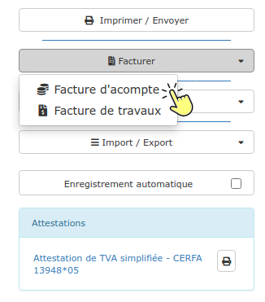
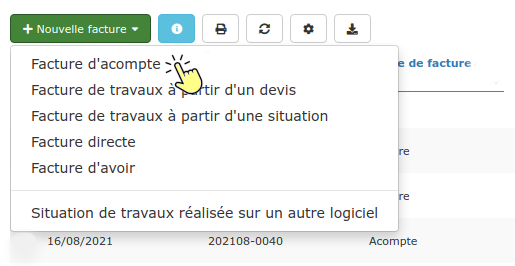

# Facture d'Acompte

## Un document obligatoire

**France - **[**Article 289**](https://www.legifrance.gouv.fr/affichCodeArticle.do?idArticle=LEGIARTI000018036005\&cidTexte=LEGITEXT000006069577)** du Code Général des Impôts**

Depuis le 1er Janvier 2004, l'établissement d'une facture d'acompte est obligatoire dès que vous percevez un acompte de la part de votre client.

## Ne pas confondre facture d'acompte et facture d'avancement (situation de travaux)

###

La facture d'acompte est une facture réalisée **avant le démarrage des travaux**

La facture d'acompte correspond à une somme d'argent versée par le client avant le démarrage des travaux, généralement pour permettre à l'entreprise de limiter ses avances de trésorerie en achats de matériaux et fournitures.


Comptablement et fiscalement, **la facture d'acompte n'est pas du chiffre d'affaires**


Lorsque les travaux ont débuté, et que l'on souhaite établir une facture intermédiaire pour obtenir un règlement, il faut réaliser une [facture d'avancement](situation-de-travaux.md) (ou situation de travaux).


**La réalisation de factures d'acompte, en cours de chantier, n'est pas légale (en France).**


****

## Réaliser une facture d'acompte

Vous devez obligatoirement avoir réalisé un devis pour pouvoir créer une facture d'acompte.

:digit_one:** **Ouvrez le devis, et cliquez sur le bouton "Facture d'acompte" à droite de la page :

         Ou bien ouvrez la liste des factures, cliquez sur "Nouvelle facture", puis "Facture d'acompte". Recherchez le devis à facturer, et validez :

:digit_two: Une fenêtre s'ouvre :

Saisissez le pourcentage d'acompte (30 pour 30%, par exemple), ou saisissez le montant hors taxes attendu.


Si le devis comporte plusieurs taux de TVA, la facture d'acompte sera réalisée avec le taux de TVA dont le montant est le plus élevé.


****

:digit_three: Validez. La facture d'acompte est automatiquement créée

:digit_four: Vérifiez-la, et validez-la en cliquant sur le bouton "Finaliser la facture" à droite de la page.

:digit_five: Vous pouvez maintenant envoyer cette facture à votre client :

* au [format papier](../../faq-aides-trucs-et-astuces/trucs-et-astuces.md#validation-de-limpression-dun-document)
* [par mail](../../aide-au-demarrage/parametrage-de-mon-entreprise/envois-par-mail/) depuis votre ordinateur, tablette, ou même depuis l'application mobile.

Le PDF est automatiquement [archivé](../../les-plus-du-logiciel/progbox-archivage-de-documents.md#archivage-des-factures-clients), conformément aux exigences de la loi en matière d'archivage des factures numériques. 

## Déduction de l'acompte sur la facture de travaux

Lorsque vous réaliserez la facture de travaux, l'acompte sera déduit automatiquement dans son intégralité du net à payer.

### Déduction partielle de l'acompte

Sur une facture de situation, vous pouvez déduire l'acompte au prorata de l'avancement :

:digit_one: Dans le pied de la facture, cliquez sur le petit crayon à côté de l'acompte déduit

:digit_two: Choisissez de déduire l'acompte au prorata de l'avancement, ou saisissez librement le montant à déduire

:digit_three: Validez

:digit_four: A la prochaine situation de travaux, le solde de l'acompte non déduit sera automatiquement appliqué.

### Déduction d'une facture d'acompte émise depuis un autre logiciel

Vous utilisiez Excel, ou un autre logiciel de devis / facturation, et vous venez de migrer sur notre logiciel de gestion.

Vous avez émis une facture d'acompte sous l'ancien logiciel et vous devez déduire cet acompte de votre prochaine facture :

:digit_one: [Créez un devis](../les-devis/saisir-un-devis/nouveau-devis/) sous le logiciel

:digit_one: [Importez votre devis](../les-devis/import-export.md#import-de-dpgf-et-devis-au-format-excel), ou saisissez-le manuellement

:digit_two: Créez votre [facture de travaux](broken-reference), ou [situation de travaux](situation-de-travaux.md), à partir du devis

:digit_three: Dans le pied de la facture, cliquez sur le petit crayon à côté de l'acompte :

Saisissez le montant à déduire (montant net à payer indiqué sur votre facture d'acompte)

