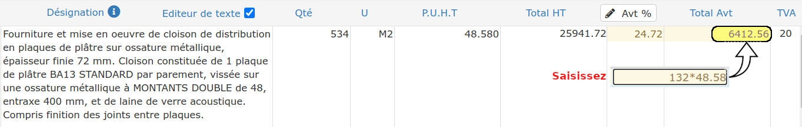
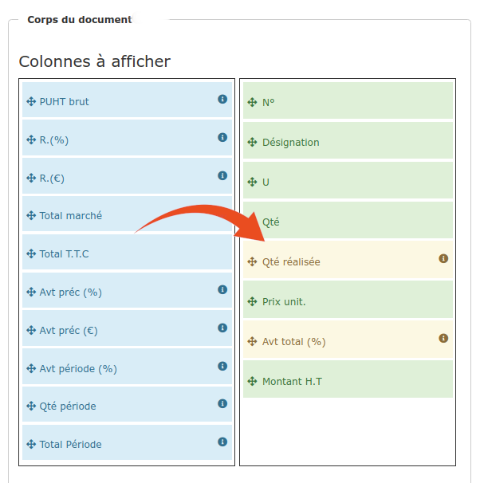

# Situations de travaux

Une facture d'avancement, ou situation de travaux, est une facture réalisée en cours de travaux, généralement pour des chantiers durant plusieurs mois.

## Ne pas confondre facture d'acompte et facture de situation

La facture d'acompte est une facture réalisée **avant le démarrage des travaux**

La facture d'acompte correspond à une somme d'argent versée par le client avant le démarrage des travaux, généralement pour permettre à l'entreprise de limiter ses avances de trésorerie en achats de matériaux et fournitures.


Comptablement et fiscalement, **la facture d'acompte n'est pas du chiffre d'affaires**


Lorsque les travaux ont débuté, et que l'on souhaite établir une facture intermédiaire pour obtenir un règlement, il faut réaliser une [facture d'avancement](situation-de-travaux.md) (ou situation de travaux). Cette facture détaille les travaux à réaliser, en appliquant à chaque ligne un pourcentage d'avancement, qui déterminera le montant de la facture et du règlement attendu.


**La réalisation de factures d'acompte, en cours de chantier, n'est pas légale (en France).**


****

## Réaliser la première situation de travaux

:digit_one: Créez une facture de travaux :

:point_right: A partir d'un devis : Cliquez sur le bouton "Facturer" à droite de la page, puis "Facture de travaux"

.png>)

:point_right: Ou bien, ouvrez la liste des factures, cliquez sur le bouton "Nouvelle facture", puis "Facture de travaux à partir d'un devis". Recherchez le devis à facturer, et validez.

:point_right: Ou encore, ouvrez la facture d'acompte, et cliquez sur le bouton "Facture de travaux" à droite de la page

:digit_two: Ouvrez l'onglet "Lignes" de la facture

Dans la colonne(pourcentage d'avancement), vous remarquerez que tous les avancements sont à 100, donc 100%

:digit_three: Vous pouvez saisir vos avancements en pourcentage, [en valeur](situation-de-travaux.md#saisir-les-avancements-en-valeur), ou [en quantité](situation-de-travaux.md#saisir-les-avancements-en-quantite).

*   Modifiez l'avancement pour chaque ligne, entre 0 et 100 :

    :point_right: 0 = les travaux de cette ligne n'ont pas encore été commencés

    :point_right: 100 = les travaux de cette ligne sont terminés

*   Appliquez le même avancement à toutes les lignes d'un titre ou d'un sous-titre en le sélectionnant, et en cliquant sur le petit crayon bleu  dans la colonne d'avancement

*   Appliquez le même avancement à tout le document :

    :point_right: Cliquez sur le bouton  en haut de colonne

    :point_right: Ou bien, depuis l'onglet "Pied" de la facture, cliquez sur le crayon vert  à droite de la case d'avancement.

Le logiciel se charge de réaliser les calculs nécessaires.

:digit_four: Vérifiez les données de l'onglet "Pied" de votre facture, modifiez / ajoutez des données **uniquement **si nécessaire (saisir d'une déduction pour [compte prorata](../deductions-complementaires/le-compte-prorata.md#dans-la-facture) par exemple).

Si vous aviez réalisé une facture d'acompte, la totalité de l'acompte sera déduite de la première situation de travaux. Si vous le souhaitez, vous pourrez [déduire l'acompte partiellement](la-facture-dacompte.md#deduction-partielle-de-lacompte).

## Réaliser les situations suivantes

Pour la prochaine facture (intermédiaire ou finale) :

:point_right: Ouvrez la dernière situation, et cliquez sur "Nouvelle situation" à droite de la page

:point_right:** **Ou bien, ouvrez la liste des factures, cliquez sur le bouton "Nouvelle facture", puis "Facture de travaux à partir d'une situation". Recherchez la dernière situation réalisée pour ce chantier, et validez.

****:warning: **Il faut toujours saisir l'avancement total de la ligne au jour de la situation**, le logiciel fera les calculs nécessaires pour déduire la situation précédente.

Exemple :

* Vous avez saisi 35 % d'avancement en situation 1
* Si vous saisissez 60% à la situation 2, le logiciel facturera 60 - 35, soit 25%
* Et si vous saisissez 100% à la situation 3, le logiciel facturera 100 - 60, soit 40%
*   Au total, vous aurez facturé 35% + 25% + 40%, soit 100% du chantier. Le compte est bon.

## Saisir les avancements en valeur

Généralement, les avancements sont saisis en pourcentage, comme décrit un peu plus haut.

Mais vous pouvez saisir le **montant** de l'avancement, plutôt que son pourcentage, en cliquant sur le bouton  en haut de colonne.

Le pourcentage d'avancement correspondant sera automatiquement calculé.


:bell: Le pourcentage d'avancement sera toujours affiché avec 2 décimales, bien que le logiciel tienne compte de toute la précision. Il peut donc y avoir des écarts de centimes si vous refaites manuellement le calcul. 

Par exemple :

* Total H.T de la ligne : 5702 €
* Total H.T de l'avancement saisi : 2500 €
* Avancement affiché par le logiciel : 43.84%
* Si vous réalisez avec une calculette l'opération 5702 \* 43.84%, vous obtiendrez 2499.75 € au lieu de 2500 €

En réalité, le logiciel applique le taux d'avancement complet, soit ‭‭43.84426517011575 ‬%

Si un client vous fait remarquer que les montants sont "faux", vous pourrez lui en donner l'explication :wink: 


## Saisir les avancements en quantité

Dans certains cas, ou certains corps d'état, il est d'usage de donner des avancements en quantités plutôt qu'en pourcentage.

Voici comment procéder :

### Dans la saisie de la situation :

Vous devez par exemple facturer  132 m²  sur  534 m²  prévus au marché, au prix unitaire de 48.58 € :

*   Dans la colonne, saisissez 132\*48.58, c'est à dire la quantité réalisée par le prix unitaire

* Le logiciel affichera immédiatement 6412.56 dans la colonne, et 24.72 dans la colonne  

### Dans le modèle de facture :

:digit_one: Ouvrez le menu "Administration > Modèles de documents", cliquez sur la section "Factures"

:digit_two: Ouvrez ou [créez votre modèle personnalisé](../../les-plus-du-logiciel/modeles-de-document.md#creer-un-modele) de facture

:digit_three: Cliquez sur la section "Corps du document" (celle indiquant les lignes d'ouvrages et leur prix)

:digit_four: A droite de la page, ajoutez la colonne "Quantité réalisée"

Cette colonne, uniquement visible dans une situation de travaux, affichera la quantité réalisée, c'est à dire 132 m² dans notre exemple.

