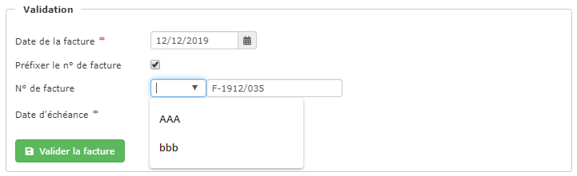

# Valider une facture

## La facture provisoire

Toute nouvelle facture est créée sous le statut "provisoire" :

* La facture provisoire peut-être modifiée et supprimée à tout moment.
* Elle porte un numéro provisoire, ce qui permet de la supprimer sans créer de "trou" dans votre numérotation comptable.
* Elle n'est pas intégrée à votre chiffre d'affaires, et ne sera pas exportée comptablement.
* Lorsque vous imprimez une facture provisoire, elle porte en filigrane la mention "Facture provisoire", conformément à la législation. 
* L'impression d'une facture provisoire permettra par exemple de faire valider les avancements de travaux par la maîtrise d'œuvre avant de finaliser la facture pour règlement.

Après avoir terminé et contrôlé votre facture provisoire, vous pouvez la "[Finaliser](valider-une-facture.md#finaliser-une-facture)".

## Finaliser une facture

Vous avez terminé et contrôlé votre facture provisoire, vous devez maintenant la "Finaliser".

Cette action a pour but de donner à cette facture une date, un numéro et une échéance définitifs, et de l'intégrer dans le calcul de votre chiffre d'affaire.\
Cette facture validée pourra être transmise à votre client, pour règlement.


Une facture validée ne pourra plus être supprimée. Si besoin, [vous devrez l'annuler par un avoir automatique.](modifier-supprimer-ou-annuler-une-facture.md#annulation)

Une facture validée pourra être [modifiée](modifier-supprimer-ou-annuler-une-facture.md) dans certains cas.


Finaliser une facture provisoire est très simple :

* Ouvrez la facture provisoire
* Cliquez sur le bouton vert "Prévisualiser / Finaliser" en haut à droite de la page

.png>)

* Votre facture s'affiche en pdf, avec la mention "Provisoire" en filigrane (obligation légale).
* Changez si besoin le [modèle de facture](../modeles-de-document.md),
* Cliquez sur le bouton vert "Finaliser la facture".
  * Vérifiez et modifiez éventuellement la date de la facture.
* Vérifiez et modifiez éventuellement la date d'échéance.
* Le numéro de facture est calculé automatiquement par le logiciel, il n'est pas modifiable.
  * Vous pouvez cependant y [ajouter un préfixe](valider-une-facture.md#comment-prefixer-un-numero-de-facture) pour gérer des séries de facturation différentes.
* Validez.

Votre facture est finalisée, et automatiquement [archivée dans votre ProGBox](valider-une-facture.md#archivage-automatique-des-factures-validees-dans-la-progbox).

#### Modifier la date de la facture.


Selon la réglementation en vigueur, la date de la facture est par défaut la date du jour, ou au plus tôt, la date de la dernière facture réalisée.

Par exemple, si la dernière facture réalisée sur le logiciel est datée du 30 Mai, et que nous sommes le 1er Juin, la date par défaut sera le 1er Juin, mais vous pouvez dater votre facture au 30 ou au 31 Mai.


Dans certains cas, vous pourriez malgré tout être amené à contourner la règle, par exemple pour facturer une situation de travaux le 25 du mois, alors que vous avez déjà réalisé des factures de travaux depuis.

Le logiciel permet de modifier la date réglementaire d'une facture, dans les limites suivantes :\
\
**Il n'est pas possible **

* **de saisir une date ultérieure à la date du jour**
* **de saisir une date antérieure à la dernière facture exportée en comptabilité**
* **de saisir une date antérieure à 20 jours à la date du jour.**
* **de modifier la date dans le cas d'une correction de facture.**


_**Il est important de savoir que ces modifications restent contraires à la réglementation, et qu'elles se font sous la responsabilité de l'utilisateur.**_


#### Comment préfixer un numéro de facture ?


_**Attention, le préfixage est à utiliser dans des cas très particuliers, vous ne devez généralement pas utiliser cette fonction.**_


Vous avez besoin de gérer plusieurs séries de facturation, selon qu'il s'agisse de dépannages ou de travaux par exemple.\
Au moment de la finalisation de la facture :

* Le logiciel affiche automatiquement le numéro de la facture.
* En cochant la case "Préfixer le n° de facture", un champ apparaît devant le numéro de facture.
* Ajouter le préfixe souhaité (par exemple "TRV" pour les factures de travaux, "DEP" pour les factures de dépannage, ...).
* Important : le compteur de numérotation de la facture sera modifié en fonction du préfixe, pour avoir une continuité de numérotation par série.

### Archivage automatique des factures validées dans la ProGBox.

Pour répondre à la réglementation, les factures que vous envoyez à vos clients doivent être archivées sur un système numérique, suffisamment sécurisé pour que ces documents soient inaltérables et conservés au moins 6 ans.

Le logiciel archive automatiquement le pdf de chaque facture validée dans la [ProGBox](../../les-plus-du-logiciel/progbox-archivage-de-documents.md#archivage-des-factures-clients), dans le dossier ".factures".

Vous pouvez maintenant [imprimer](imprimer-une-facture.md) ou envoyer votre facture par mail à votre client.

