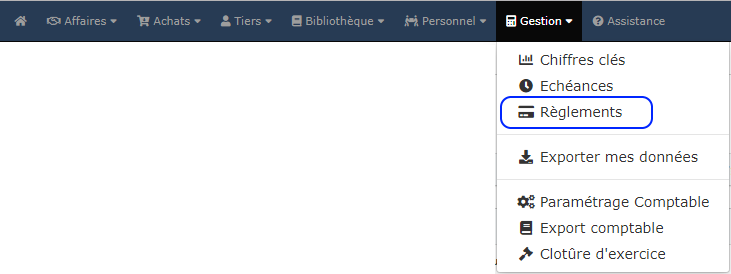

# 📎 Consulter les règlements

Sous le logiciel, vous pourrez consulter :

* La liste de tous les règlements : encaissements et paiements de vos clients, fournisseurs et sous-traitants, y compris les restitutions de retenues de garantie
* La liste des règlements d'un client, fournisseur ou sous-traitant en particulier
* Les règlements enregistrés pour une même facture.

## :digit\_one: Liste des règlements

Ouvrez le menu "Gestion > Règlements" :&#x20;

La liste affiche tous les règlements clients, fournisseurs et sous-traitants saisis.

Vous pouvez facilement filtrer votre liste pour retrouver les règlements d'un tiers en particulier, et/ou les règlements sur une période par exemple.

## :digit\_two: Règlements d'un tiers

* Ouvrez la fiche client, fournisseur ou sous-traitant
* Ouvrez l'onglet "Activité"
* Ouvrez la section "Etat financier".

.png>)

_Cliquez _[_ici_](../les-tiers/les-clients/la-fiche-client-en-details.md#onglet-activite)_ pour en savoir plus sur l'état financier client._

_Cliquez _[_ici_](../les-tiers/les-fournisseurs/la-fiche-fournisseur-en-details.md#onglet-activite)_ pour en savoir plus sur l'état financier fournisseur / sous-traitant._

__

## :digit\_three: Règlements d'une facture

Ouvrez une facture réglée (totalement ou partiellement), le ou les règlements associés seront affichés sur la partie droite de la page.

En cliquant sur un règlement, le détail s'affichera à l'écran.

Il n'est pas possible de modifier ou supprimer un règlement, mais vous pourrez l'annuler et le ressaisir, et il en restera toujours une trace, conformément à la législation.

.png>)

