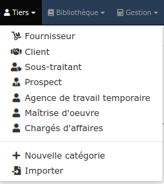
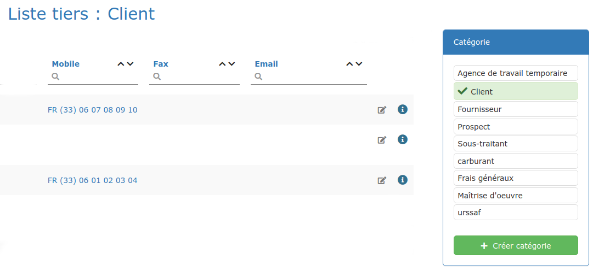
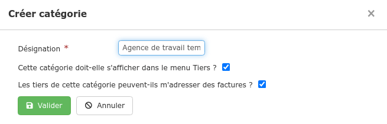
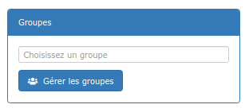
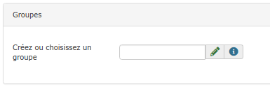
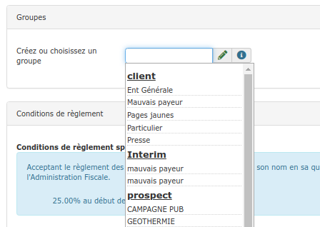
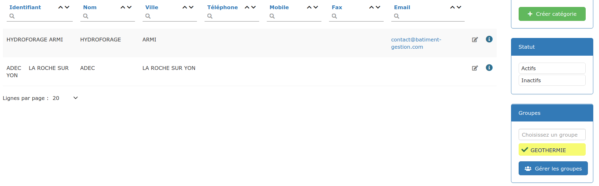

# Catégories et groupes de tiers

## 1 Catégories de tiers

Plusieurs catégories de tiers sont proposées par défaut :

* Clients
* Fournisseurs
* Prospects
* Sous-traitants.

[Créez vos tiers](les-listes-de-tiers/creer-un-tiers.md) dans chacune des catégories proposées.

### **Créez vos propres catégories de tiers**

Comme par exemple "Architectes", "Entreprises de travail temporaire", ou encore "[Frais généraux](../les-achats/les-frais-generaux.md)".

👉 Depuis le menu "Tiers &gt; Nouvelle catégorie" :

Ou bien, depuis une [liste de tiers](les-listes-de-tiers/), à droite de la page, cliquez sur "Créer catégorie" :

👉 Définissez si cette catégorie de tiers peut vous adresser des factures : 

* Les dépenses auprès de ces tiers \([factures d'achat](../les-achats/les-factures-dachat.md)\) pourront alors être enregistrées sous le logiciel, et affectées à un chantier, pour mieux en évaluer la [rentabilité](les-clients/la-fiche-client-en-details.md#onglet-activite). 

* Vous pourrez également saisir et suivre vos [règlements](../les-reglements/reglements-fournisseurs.md) adressés à ces tiers.

## 2 Groupes de tiers

Vous pouvez affecter un ou plusieurs groupes à vos tiers, de sorte à mieux les trier et mieux les identifier :

* **Par activité** : Mairies, Profession libérale, Agence immobilière, Négoce, Plombier, ...
* **Mais aussi** : Mauvais payeur, Partenaire, Famille, ...

### Créer un groupe

👉 Depuis une [liste de tiers](les-listes-de-tiers/), à droite de la page : cliquez sur "Gérer les groupes", puis sur "Nouveau groupe"

👉Ou bien depuis la [fiche du tiers](les-clients/la-fiche-client-en-details.md) : saisissez le nom du groupe à créer et tapez sur la touche 'Tabulation' ou 'Entrée' de votre clavier, il sera automatiquement créé dans votre liste de groupes et ajouté à la fiche client.

### Affecter un tiers à un groupe

👉 Depuis la [fiche du tiers](les-clients/la-fiche-client-en-details.md) : saisissez les premières lettres du groupe, et sélectionnez-le dans la liste proposée

👉 Pour détacher un groupe d'une fiche tiers, désélectionnez simplement le nom du groupe en cliquant dessus \(il passera du vert au blanc\).

\*\*\*\*⚠ **N'oubliez pas d'enregistrer avant de fermer le formulaire.**

💡 Depuis votre liste de tiers, vous pourrez activer le filtre d'un groupe, pour ne voir que les tiers affectés à ce groupe.

### Modifier ou supprimer un groupe

👉 Depuis une liste de tiers : cliquez sur "Gérer les groupes", puis sur le groupe à modifier / supprimer.

👉 Depuis une fiche tiers : cliquez sur le crayon vert , puis sélectionnez le groupe à modifier / supprimer.

