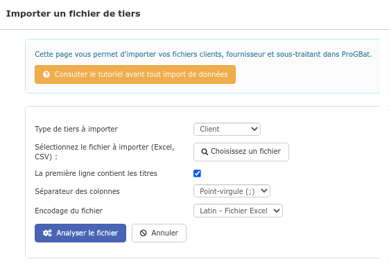
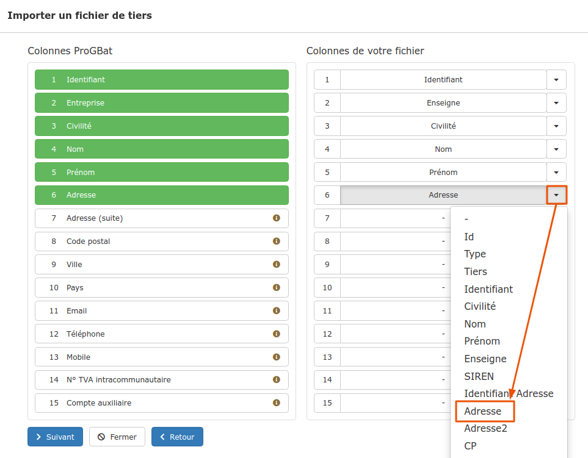
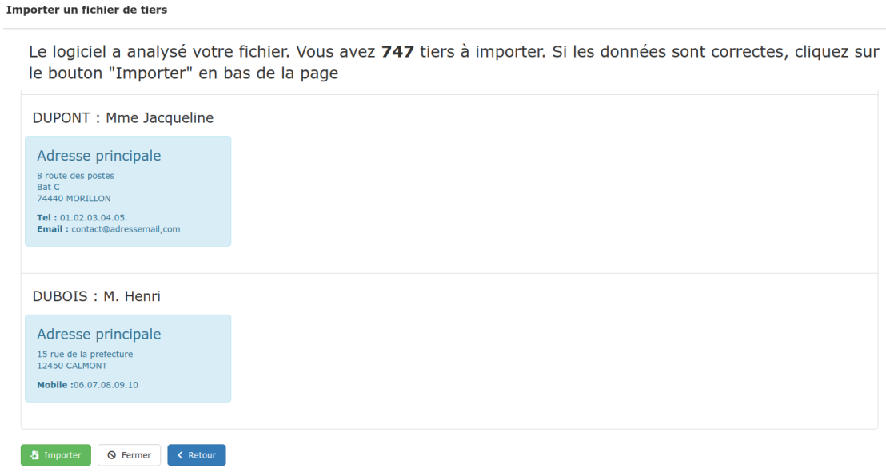

# 🔴 Importer clients et fournisseurs

Vous pouvez importer vos fichiers clients, fournisseurs et sous-traitants en provenance d'un autre logiciel, après les avoirs extraits au format Excel, ou .csv

Dans cet article, nous parlerons du fichier client, la procédure est exactement identique pour les fournisseurs et les sous-traitants.

## Préparez votre fichier


Le fichier doit être au format Excel (.xlsx), ou csv (.csv).


:digit_one: Ouvrez le fichier dans votre logiciel de tableur

:digit_two: Vérifiez que la première ligne contienne des titres de colonnes, ce sera plus pratique lors de l'importation

.png>)

:digit_three: Vérifiez le contenu de votre fichier : il doit contenir au moins le nom du client et/ou le nom de l'entreprise

* Si les 2 sont renseignés, le client sera créé au nom de l'entreprise, et un contact sera créé avec les noms et prénoms
* Si un client a plusieurs adresses :
  * S'il s'agit d'une entreprise, le nom de l'entreprise doit être répété exactement sur chaque ligne
  * S'il s'agit d'un particulier, le nom et le prénom doivent être répétés exactement sur chaque ligne

:digit_four: Enregistrez le fichier.


Le fichier ne doit contenir aucune formule, aucun "chaînage".


## Importez votre fichier

:digit_one:Ouvrez le menu "Tiers > Importer", et sélectionnez le type de tiers : Client, Fournisseur, Sous-traitant ou toute autre [catégorie de tiers](categories-et-groupes-de-tiers.md#categories) que vous aurez créé

:bulb: Ou bien depuis votre liste de clients ou de fournisseurs, cliquez simplement sur le bouton "Importer mes clients" ou "Importer mes fournisseurs"

:digit_two: Recherchez votre fichier (.xlsx, .csv)

:digit_three: Précisez si [la première ligne de votre fichier contient des titres](importer.md#preparez-votre-fichier)

_Généralement, vous n'avez pas à modifier le séparateur et l'encodage du fichier, sauf éventuellement si le fichier est issu d'un logiciel américain._

:digit_four: Cliquez sur "Analyser le fichier"

:digit_five: Faites correspondre les colonnes disponibles sous le logiciel (colonne de gauche) avec les colonnes de votre fichier

:digit_six: Cliquez sur suivant

:digit_seven: Après vérification des données, Importez le fichier.

