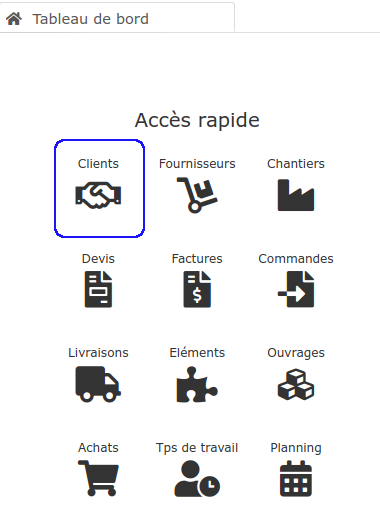

# Clients

Acteurs majeurs de votre entreprise, les clients occupent une place primordiale dans votre développement économique.

Bien connaître vos clients, et bien les répertorier, c'est vous permettre de mieux les fidéliser, et d'être plus rapide et efficace sous le logiciel.

Sous le logiciel, vous allez pouvoir :

:point_right: [Créer](creer-un-client-ou-prospect.md) ou [importer](../importer.md) vos clients et prospects, pour constituer et gérer facilement votre portefeuille ([liste](../les-listes-de-tiers.md)) de clients.

:point_right: Analyser et suivre les relations avec vos clients, grâce à la [fiche client](la-fiche-client-en-details.md), et son [outil de pilotage simplifié](la-fiche-client-en-details.md#onglet-activite)​​.

:point_right: Créer vos [devis](../../les-devis/nouveau-devis/) et [factures](../../les-factures/) client.

:point_right: Créer un [chantier](../../les-chantiers-1/creer-un-chantier.md) pour suivre, par affaire, les différents travaux effectués pour un même client. Depuis la fiche chantier, évaluez la [rentabilité de vos travaux](../../les-chantiers-1/la-fiche-chantier-en-detail.md#onglet-travaux).


[creer-un-client-ou-prospect.md](creer-un-client-ou-prospect.md)



[la-fiche-client-en-details.md](la-fiche-client-en-details.md)


