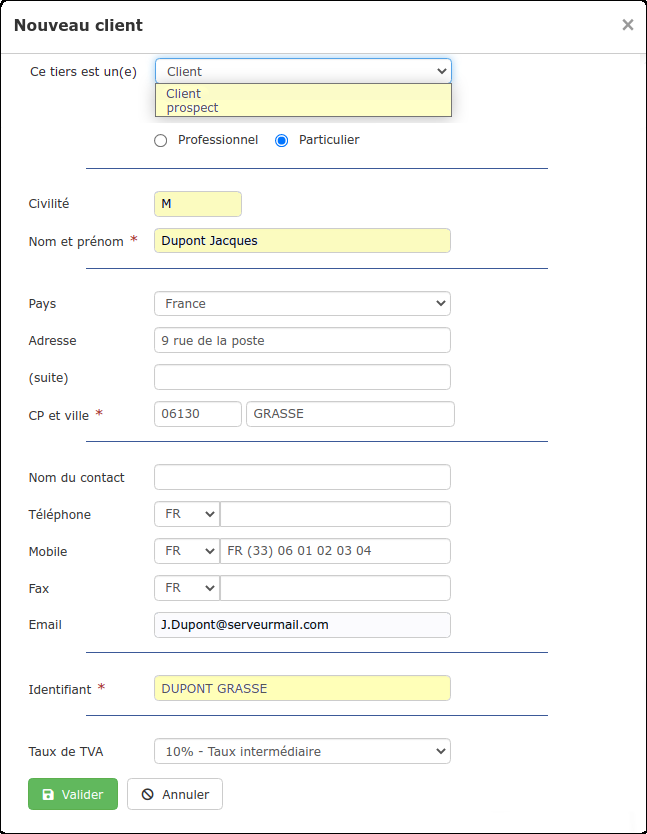
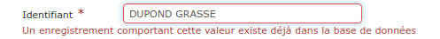

# ➖ Créer un Client / Prospect

:bulb: Si vous disposez déjà d'une liste de clients hors logiciel, [importez votre fichier ](../importer.md)sous le logiciel et gagnez un précieux temps de saisie.


Créer un client (ou un prospect) va générer une [fiche client](la-fiche-client-en-details.md), automatiquement enregistrée dans votre [liste de tiers](../les-listes-de-tiers.md).

La fiche client va centraliser toutes les informations, données et documents liés à votre client :

*   Ses coordonnées bien sûr, mais aussi les chantiers commandés par ce client, ainsi que les devis et factures qui ont été créés pour lui.

* C'est également sur la fiche client que vous pourrez constater le chiffre d'affaires qu'il a généré, les sommes réglées et celles restant à devoir. Depuis la fiche client, relancez votre client et saisissez ses règlements.


Sous le logiciel, il existe 2 manières de créer un client (ou un prospect) :

### :digit\_one: Au moment de la création d'un devis


:bulb: Cette méthode permet de constituer votre liste de clients au fil de vos chiffrages.


*   Lorsque vous [créez un devis](broken-reference), le logiciel vous propose de créer ou de choisir un client

* Choisissez "Créer un nouveau client"

####

#### Un formulaire s'ouvre :

:point\_right: Si vous n'avez jamais travaillé pour ce client, identifiez-le comme "Prospect", il sera enregistré dans la [catégorie](../categories-et-groupes-de-tiers.md#categories) du même nom :

* A l'acceptation du devis, le prospect devient automatiquement client
* Depuis la [fiche du prospect](la-fiche-client-en-details.md), consultez les devis en attente de retour ou refusés, pour relancer ce prospect ou analyser les raisons de son refus (chiffrage peu attractif?), et peut-être lui faire une meilleure offre.

:point\_right: Les champs suivis d'un astérisquedoivent être renseignés pour pouvoir valider la création du client (ou prospect), mais il est conseillé de remplir le formulaire au complet, votre fiche client sera ainsi déjà complétée avec ces informations, et vous n'aurez pas à les saisir plus tard.

:point\_right: Un identifiant client est automatiquement créé, sous le format "NOM VILLE". Modifiez au besoin cet identifiant, car il vous permettra de retrouver rapidement votre client sous le logiciel (à la création d'un devis / facture par exemple).

Deux clients ne peuvent pas avoir le même identifiant, ainsi, pas de risque d'erreur :

:point\_right: Le dernier champ "Taux de TVA" permet de déterminer une TVA par défaut.&#x20;

* Ce taux sera alors appliqué automatiquement à la création d'un devis/facture pour ce client
* Vous pourrez [modifier ce taux](../../les-devis/les-indispensables-du-devis/tva-multiple.md) depuis vos documents, et ainsi l'ajuster en fonction des ouvrages à réaliser.

### :digit\_two:  Depuis la liste des clients, ou celle des prospects

*   Ouvrez le menu "Tiers", et sélectionnez "Client", ou "Prospect"

*   Cliquez sur le bouton "Nouveau client", ou "Nouveau Prospect"

* Le formulaire de création du client / prospect s'ouvrira, complétez-le comme indiqué [ci-dessus](./#un-formulaire-souvre).


[la-fiche-client-en-details.md](la-fiche-client-en-details.md)


