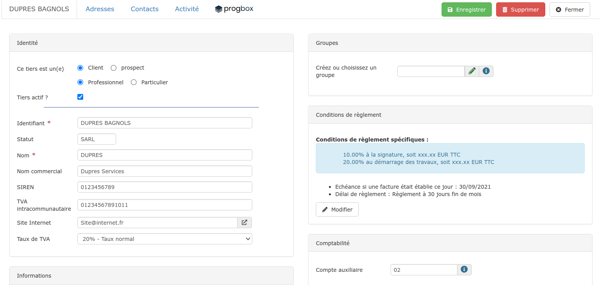
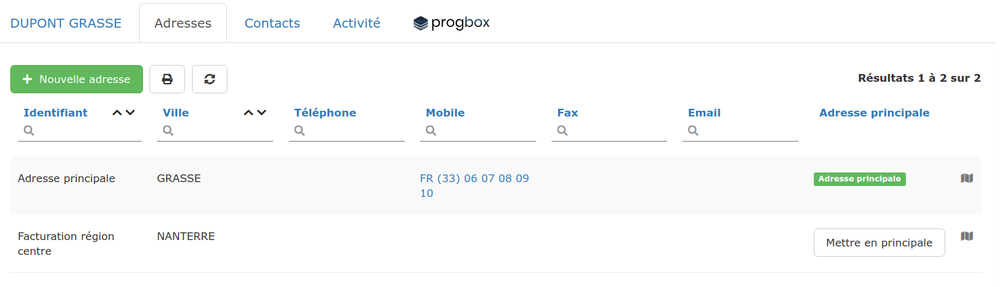
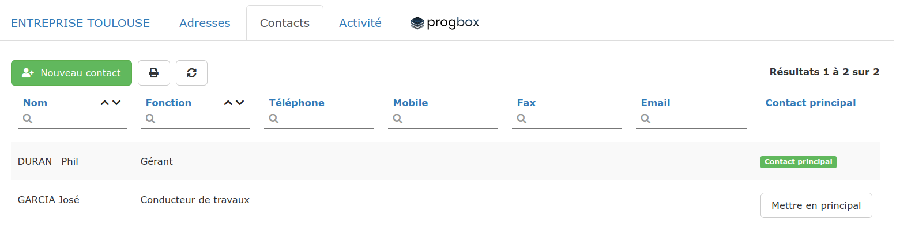
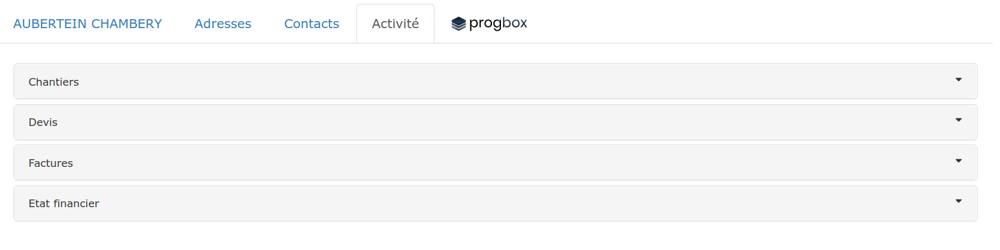
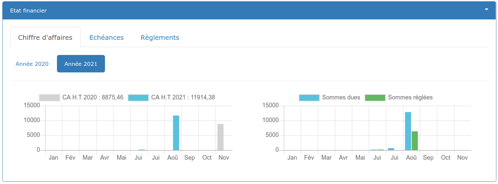

# La fiche Client en détails

Découvrez toute l'utilité de chacun des 4 onglets de cette fiche :

## ****:digit_one: **Onglet  Coordonnées du client**

*   **Identité**

    * Modifiez les informations d'identification de votre client, ou apportez-y des informations complémentaires.
    * Si votre client est un professionnel, vous pourrez alors saisir son Nom commercial, son SIREN, N° de TVA intracommunautaire, et son Site internet.
    * Décochez "Tiers actif?" pour ne plus voir apparaître ce client à la création d'un devis/facture, tout en le conservant dans votre [liste de tiers](../les-listes-de-tiers/).
    * Définissez ici le taux de [TVA par défaut pour ce client](tva.md).

*   **Informations**

    Ce champ libre permet de saisir toute information utile concernant le client ou les affaires traitées pour ce client (attention à ne pas saisir d'[informations "sensibles" au sens de la CNIL](https://www.cnil.fr/fr/cnil-direct/question/une-donnee-sensible-cest-quoi)).

*   **Groupes**

    Vous pouvez affecter un ou plusieurs groupes à vos clients, de sorte à mieux les trier et mieux les identifier. Cliquez [ici](../categories-et-groupes-de-tiers.md#groupes-de-tiers) pour savoir comment procéder.

*   **Conditions de règlement**

    Créez des conditions de règlement spécifiques à ce client, elles seront appliquées par défaut à tous les documents créés pour ce client. Cliquez [ici](../../../aide-au-demarrage/parametrage-de-mon-entreprise/conditions-de-reglement.md#conditions-de-reglement-specifiques) pour apprendre à définir ces conditions spécifiques.

*   **Comptabilité**

    Définissez un compte auxiliaire pour ce client.

    **Peu importe votre choix de paramétrage des comptes auxiliaires, si vous saisissez un compte auxiliaire dans cette fiche, c'est ce compte qui sera utilisé.**

    Pour en savoir plus sur la gestion des comptes auxiliaires sous le logiciel, cliquez [ici](../../exports-comptables/).

    Pour en savoir plus sur les paramétrages comptables proposés par le logiciel, cliquez [ici](../../exports-comptables/).

## ****:digit_two: **Onglet  Adresses**

Renseignez les différentes adresses de votre client : Siège social, dépôts, agences, etc...

Par défaut, la première adresse saisie est considérée comme "Adresse principale", c'est celle-ci qui figurera sur vos devis / factures créés pour ce client.

Pour changer cette adresse principale, cliquez sur le bouton blanc "Mettre en principale".

Un lien Google Maps se crée automatiquement pour chacune des adresses saisies, il ne vous reste plus qu’à cliquer** **sur l'icôneen bout de ligne pour préparer votre déplacement ou celui de vos compagnons.

## ****:digit_three: **Onglet  Contacts**

Ajoutez tout interlocuteur utile à votre relation avec ce client (Gérant, Chargé d'affaires, Paul Henri du service facturation, ...).

:bulb: Si les interlocuteurs du chantier sont souvent les mêmes pour ce client, ajoutez-les également (Architecte, Conducteur de travaux, ...). Sinon, ils pourront être renseignés sur la [fiche chantier](../../les-chantiers-1/la-fiche-chantier-en-detail.md#onglet-contacts).

Par défaut, le premier contact saisi est considérée comme "Contact principal", c'est celui-ci qui figurera sur vos devis / factures créés pour ce client.

Pour changer ce contact principal, cliquez sur le bouton blanc "Mettre en principal".

## ****:digit_four: **Onglet  Activité**

**Visualisez en un clic l’activité de ce client au sein de votre entreprise **: 

Retrouvez tous les chantiers, devis et factures créés pour ce client. Accédez à chaque affaire ou document en cliquant simplement sur la ligne concernée.

:bulb: La section "Etat financier" est un outil de pilotage simplifié :

:heavy_check_mark:**Constatez l'évolution des principaux indicateurs financiers pour ce client**, évaluez "l'importance" de votre relation et sa "fiabilité" en tant que payeur - depuis l'onglet "Chiffre d’Affaires" :

*   Historique du CA généré par ce client. 

    Dans l'exemple ci-dessus, cliquer sur le bouton "Année 2020" affichera les données de l'année 2020, comparées à l'année 2019.

* Historique et proportion des montants facturés à ce client, et ceux réglés.

:heavy_check_mark:**Visualisez toutes les factures non réglées par ce client, et menez les actions adéquates - **depuis l'onglet «Échéances» :

A droite de la page, cliquez sur le filtre :

*   Factures en retard :

    * Cliquez sur l'icôneen bout de ligne pour éditer une relance client, ou un relevé de compte.
    * Cliquez sur l'icônepour saisir un règlement client.

* Factures sans retard :
  * Evaluez les montants à percevoir.
  *   Relancez votre client avant échéance, en cliquant sur l'icôneen bout de ligne.

:heavy_check_mark: **Retrouvez tous les règlements effectués par ce client, y compris les restitutions de retenues de garantie **- depuis l'onglet "Règlements"

* Sélectionnez un règlement pour en voir les détails.


Retrouvez plus d'indicateurs via les chiffres clés.


