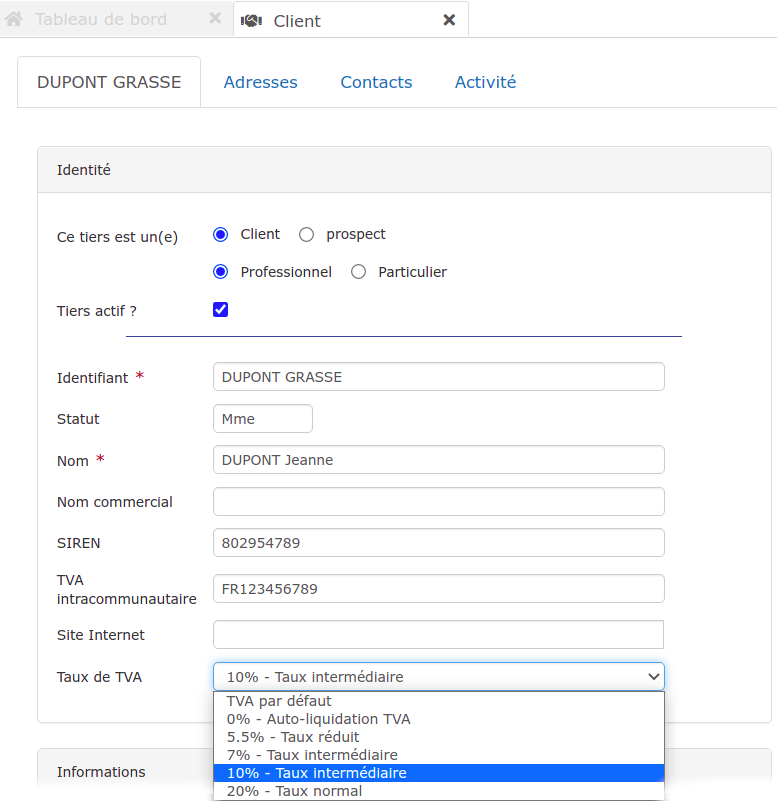

# ➖ TVA par client

Choisissez le taux de TVA qui sera appliqué par défaut aux documents créés pour chacun de vos clients.

A la création d'un client, ou bien en accédant à une fiche client, vous pourrez déterminer un taux de TVA par défaut.

Ce taux sera alors appliqué automatiquement à la création d'un devis/facture pour ce client, sera prioritaire face au taux de TVA sélectionné dans vos préférences utilisateur (Menu "Utilisateur > Préférences").

Vous pourrez bien sûr [modifier ce taux](../../les-devis/les-indispensables-du-devis/tva-multiple.md) à volonté depuis vos documents, et ainsi l'ajuster en fonction des ouvrages à réaliser.
