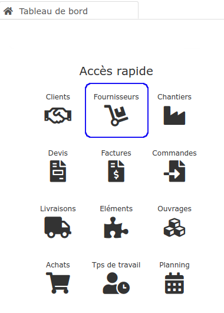

# Fournisseurs

Bien suivre et bien gérer les relations avec vos fournisseurs est essentiel pour maintenir voire baisser vos coûts, donc pour maintenir voire augmenter la rentabilité de vos chantiers. C'est aussi l'assurance d'un approvisionnement pérenne.

Sous le logiciel, vous allez pouvoir :

👉 [Créer](creer-un-fournisseur.md) ou [importer](../importer.md) vos fournisseurs, pour les [répertorier](../les-listes-de-tiers/) clairement et facilement.

👉 Analyser et suivre les relations avec vos fournisseurs, grâce à la [fiche fournisseur](la-fiche-fournisseur-en-details.md), et son [outil de pilotage simplifié](../les-clients/la-fiche-client-en-details.md#onglet-activite)​​.

👉 Directement depuis la [synthèse du devis](../../les-devis/synthese-du-devis.md), créer une demande de prix, ou un bon de commande, sans avoir à le saisir.

👉 Depuis un [bon de commande fournisseurs](../../les-achats/les-bons-de-commande/#bon-de-commande-fournisseur), enregistrer et suivre les [livraisons](../../les-achats/les-bons-de-livraison/), puis créer une [facture d'achat](../../les-achats/les-factures-dachat.md), sans avoir à les saisir.

👉 Les factures d'achat seront automatiquement ou manuellement affectées à un ou plusieurs chantiers, pour mieux en évaluer la [rentabilité](../../les-chantiers-1/la-fiche-chantier-en-detail.md#onglet-travaux).





