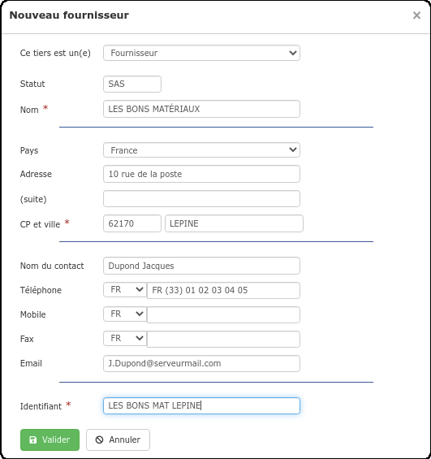
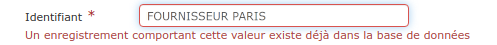

# Créer un Fournisseur

💡 Si vous disposez déjà d'une liste de fournisseurs hors logiciel, [importez votre fichier](../importer.md) sous le logiciel et gagnez un précieux temps de saisie.


Créer un fournisseur va générer une [fiche fournisseur](la-fiche-fournisseur-en-details.md), automatiquement enregistrée dans votre [liste de tiers](../les-listes-de-tiers/).

La fiche fournisseur va centraliser toutes les informations, données et documents liés à votre fournisseur :

* Ses coordonnées bien sûr, mais aussi les commandes, ainsi que les livraisons et factures d'achat qui ont été créées pour lui.

* C'est également sur la fiche fournisseur que vous pourrez constater le chiffre d'affaires que vous lui permettez de générer, les sommes réglées, et celles restant à devoir. Depuis la fiche fournisseur, saisissez vos règlements.


#### Sous le logiciel, il existe plusieurs façons de créer un fournisseur :

### 1 Au moment de la création d'un bon de commande, ou d'une facture d'achat


💡 Cette méthode permet de constituer votre liste de fournisseurs au fil de vos commandes.


* Lorsque vous [créez un bon de commande fournisseur](../../les-achats/les-bons-de-commande/#creer-une-commande), ou une [facture d'achat](../../les-achats/les-factures-dachat.md#nouvelle-facture-dachat), le logiciel vous propose de créer ou de choisir un fournisseur

* Choisissez "Créer un fournisseur"

#### 

#### Un formulaire s'ouvre :

👉 Les champs suivis d'un astérisquedoivent être renseignés pour pouvoir valider la création du fournisseur, mais il est conseillé de remplir le formulaire au complet, votre fiche fournisseur sera ainsi déjà complétée avec ces informations, et vous n'aurez pas à les saisir plus tard.

👉 Un identifiant fournisseur est automatiquement créé, sous le format "NOM VILLE". Modifiez au besoin cet identifiant, car il vous permettra de retrouver rapidement votre fournisseur sous le logiciel \(à la création d'un bon de commande / facture d'achat par exemple\).

Deux fournisseurs ne peuvent pas avoir le même identifiant, ainsi, pas de risque d'erreur :

### 2  Depuis la liste des fournisseurs

* Ouvrez le menu "Tiers", et sélectionnez "Fournisseur"

* Cliquez sur le bouton "Nouveau Fournisseur"

* Le formulaire de création du fournisseur s'ouvrira, complétez-le comme indiqué [ci-dessus](./#un-formulaire-souvre).



