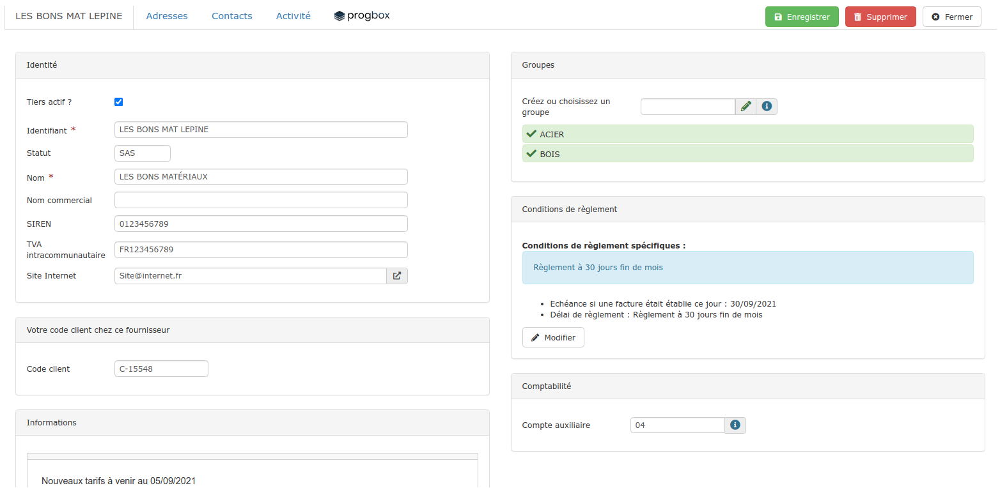
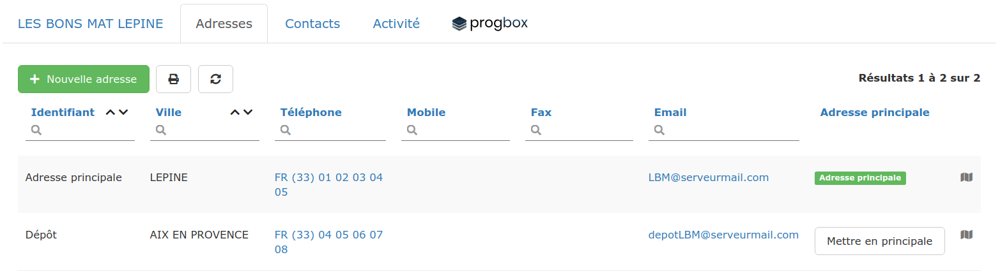
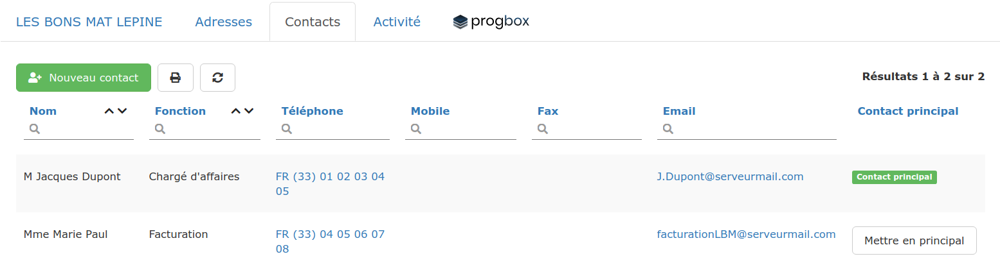
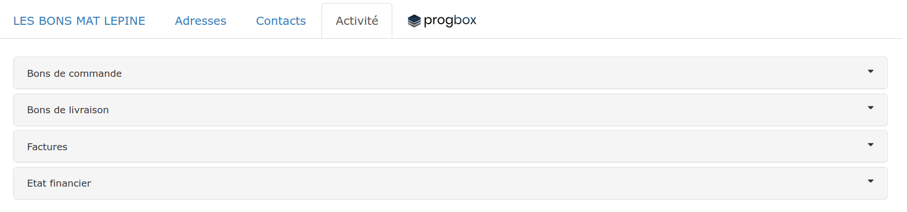
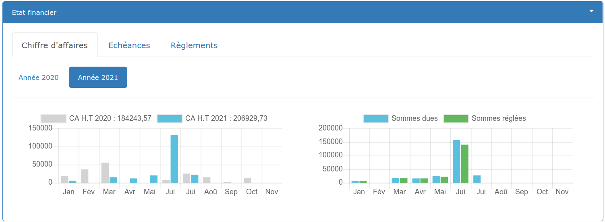
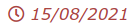

# La fiche Fournisseur en détails

Découvrez toute l'utilité de chacun des 4 onglets de cette fiche :

## ****:digit_one: **Onglet  Coordonnées du fournisseur**

****

* **Identité**
  * Modifiez les informations d'identification de votre fournisseur, ou apportez-y des informations complémentaires.
  *   Décochez "Tiers actif?" pour ne plus voir apparaître ce fournisseur à la création d'un bon de commande / facture d'achat, tout en le conservant dans votre [liste de tiers](../les-listes-de-tiers/).

*   **Informations**

    Ce champ libre permet de saisir toute information utile concernant le fournisseur ou les affaires conclues avec ce fournisseur (attention à ne pas saisir d'[informations "sensibles" au sens de la CNIL](https://www.cnil.fr/fr/cnil-direct/question/une-donnee-sensible-cest-quoi)).

*   **Groupes**

    Vous pouvez affecter un ou plusieurs groupes à vos fournisseur, de sorte à mieux les trier et mieux les identifier. Cliquez [ici](../categories-et-groupes-de-tiers.md#groupes-de-tiers) pour savoir comment procéder.

*   **Conditions de règlement**

    Enregistrez les conditions de règlement conclues avec votre fournisseur, elles serviront à [suivre vos échéances de paiement](la-fiche-fournisseur-en-details.md#onglet-activite). Cliquez [ici](../../../aide-au-demarrage/parametrage-de-mon-entreprise/conditions-de-reglement.md#conditions-de-reglement-specifiques) pour apprendre à définir ces conditions spécifiques.

*   **Comptabilité**

    Définissez un compte auxiliaire pour ce fournisseur.

    **Peu importe votre choix de paramétrage des comptes auxiliaires, si vous saisissez un compte auxiliaire dans cette fiche, c'est ce compte qui sera utilisé.**

    Pour en savoir plus sur la gestion des comptes auxiliaires sous le logiciel, cliquez [ici](../../exports-comptables/).

    Pour en savoir plus sur les paramétrages comptables proposés par le logiciel, cliquez [ici](../../exports-comptables/).

## ****:digit_two: **Onglet  Adresses**

Renseignez les différentes adresses de votre fournisseur : Siège social, dépôt, etc...

Par défaut, la première adresse saisie est considérée comme "Adresse principale", c'est celle-ci qui figurera sur vos devis / factures créés pour ce fournisseur.

Pour changer cette adresse principale, cliquez sur le bouton blanc "Mettre en principale".

Un lien Google Maps se crée automatiquement pour chacune des adresses saisies, il ne vous reste plus qu’à cliquer** **sur l'icôneen bout de ligne pour préparer votre déplacement ou celui de vos collaborateurs.

## ****:digit_three: **Onglet  Contacts**

Ajoutez tout interlocuteur utile à votre relation avec ce fournisseur (Gérant, Chargé d'affaires, Paul Henri du service facturation, ...).

Par défaut, le premier contact saisi est considérée comme "Contact principal", c'est celui-ci qui figurera sur vos devis / factures créés pour ce client.

Pour changer ce contact principal, cliquez sur le bouton blanc "Mettre en principal".

## ****:digit_four: **Onglet  Activité**

Retrouvez toutes les commandes, livraisons et factures d'achat créés pour ce fournisseur. Accédez à chaque document en cliquant simplement sur la ligne concernée.

:bulb: La section "Etat financier" est un outil de pilotage simplifié :

:heavy_check_mark:**Constatez l'évolution de vos achats auprès de ce fournisseur**, et ce que vous lui rapportez. Évaluez "l'importance" de votre relation et les sommes restant à lui régler - depuis l'onglet "Chiffre d’Affaires" :

*   Historique du CA fournisseur, généré par votre entreprise.

    Dans l'exemple ci-dessus, cliquer sur le bouton "Année 2020" affichera les données de l'année 2020, comparées à l'année 2019.

* Historique et proportion des montants facturés par ce fournisseur, et ceux réglés.

:heavy_check_mark:**Visualisez toutes les factures restant à payer à ce fournisseur, et menez les actions adéquates - **depuis l'onglet «Échéances» :

A droite de la page, cliquez sur le filtre :

*   Factures en retard  :

    * Cliquez sur l'icônepour saisir votre règlement.

*   Factures sans retard :

    * Evaluez les montants à régler, pour prévoir la trésorerie nécessaire.

:heavy_check_mark: **Retrouvez tous les règlements adressés à ce fournisseur **- depuis l'onglet "Règlements"

* Sélectionnez un règlement pour en voir les détails.


Retrouvez plus d'indicateurs via les chiffres clés.


