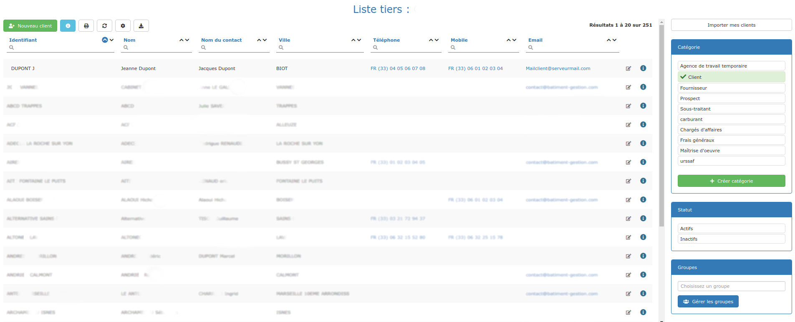
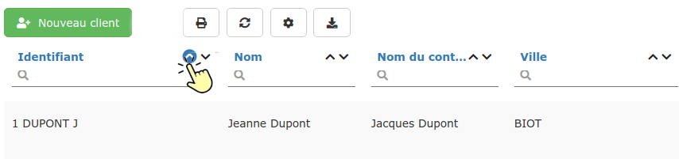
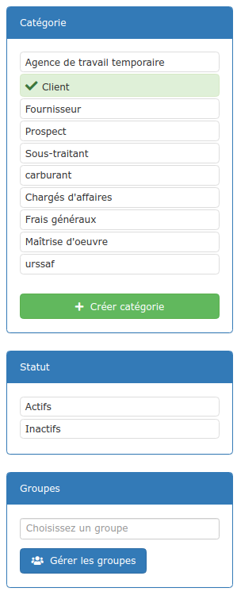
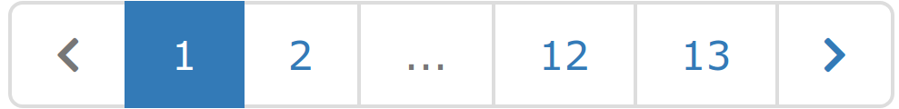

# Listes de Tiers

Vous avez [créé](../les-clients/creer-un-client-ou-prospect.md) ou [importé](../importer.md) vos tiers, peut-être créé des [catégories](../categories-et-groupes-de-tiers.md#categories) et [groupes de tiers](../categories-et-groupes-de-tiers.md#groupes-de-tiers).

Vos tiers sont à présent listés, répertoriés.

En plus de vous permettre l'accès à vos [fiches tiers](../les-clients/la-fiche-client-en-details.md), voici ce que vous pouvez réaliser à partir d'une liste de tiers :

### :digit_one: Les recherches

*   Cliquez dans un champ de recherche en entête de colonne, marqué d'une loupe

*   Saisissez quelques lettres ou chiffres, la recherche commence automatiquement après 1 seconde

* Vous pouvez faire des recherches multi-colonnes.

### :digit_two: **Les tris**

* Vous pouvez trier les colonnes en ascendant  ou en descendant , en cliquant simplement sur l'une ou l'autre des flèches**.**
  * Lorsqu'un tri est actif, la flèche apparaît dans une pastille bleue :
  *   Pour changer l'ordre du tri, cliquez simplement sur l'autre flèche.

*   Pour désactiver le tri d'une colonne, il suffit de cliquer sur la pastille pour la désactiver, elle passera du bleu au blanc :

*   Vous pouvez effectuer des tris multiples, le tri sera réalisé dans l'ordre dans lequel vous l'activez. 

    :bulb: En cas de doute sur l'ordre des tris, désélectionnez tous les tris et recommencez.

### :digit_three: Les filtres

A droite de la page, des filtres vous sont proposés :

:point_right: Catégorie : Activez le filtre d'une catégorie de tiers pour voir uniquement ce type de tiers.

:point_right: Statut : Activez le filtre "Actifs" pour ne pas voir les clients inactifs.

:point_right: Groupes : Recherchez un groupe pour voir uniquement les tiers affectés à ce groupe.

Vous pourrez appliquer plusieurs filtres, pour un résultat ciblé.

### :digit_four: **Les fonctions** 

Affiche la liste tiers dans un nouvel onglet, dans un format que vous pouvez imprimer

  Rafraîchit la liste

   Permet de paramétrer votre liste : Sélectionnez de nouvelles colonnes à afficher, ou au contraire choisissez d'en masquer

  Exporte, et télécharge sur votre ordinateur, le contenu de la liste (toutes les pages) dans un fichier CSV, utilisable sur Excel ou tout autre logiciel de tableur.

##

### ****:digit_five: **Nombre de lignes**

*   Par défaut, les listes contiennent 20 lignes par page. Vous pouvez modifier le nombre de lignes à afficher en bas à gauche de la liste.

* Si le nombre de lignes de la liste dépasse le nombre de lignes affichées, un système de navigation apparaît en bas à droite de la liste.
