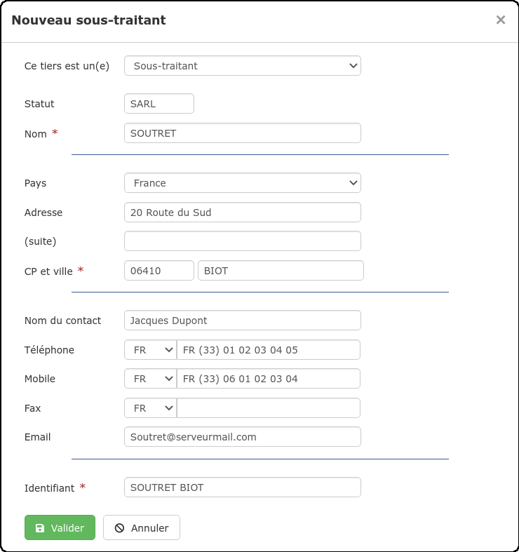
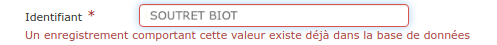

# Créer un Sous-traitant


Créer un sous-traitant va générer une [fiche sous-traitant,](la-fiche-sous-traitants-en-details.md) automatiquement enregistrée dans votre [liste de tiers](../les-listes-de-tiers/).

La fiche sous-traitant va centraliser toutes les informations, données et documents liés à votre sous-traitant :

* Ses coordonnées bien sûr, mais aussi les commandes, ainsi que les livraisons et factures d'achat qui ont été créées pour lui.

* C'est également sur la fiche sous-traitant que vous pourrez constater le chiffre d'affaires que vous lui permettez de générer, les sommes réglées, et celles restant à devoir. Depuis la fiche sous-traitant, saisissez vos règlements.


#### Sous le logiciel, il existe plusieurs façons de créer un sous-traitant :

### 1 Au moment de la création d'un bon de commande, ou d'une facture d'achat


💡 Cette méthode permet de constituer votre liste de sous-traitants au fil de vos commandes.


* Lorsque vous [créez un bon de commande sous-traitant](../../les-achats/les-bons-de-commande/#bon-de-commande-sous-traitant) ou une [facture d'achat](../../les-achats/les-factures-dachat.md#saisir-une-facture-fournisseur-sans-commande-ni-bon-de-livraison), le logiciel vous propose de créer ou de choisir un sous-traitant

* Choisissez "Créer un sous-traitant"

#### 

#### Un formulaire s'ouvre :

👉 Les champs suivis d'un astérisquedoivent être renseignés pour pouvoir valider la création du sous-traitant, mais il est conseillé de remplir le formulaire au complet, votre fiche sous-traitant sera ainsi déjà complétée avec ces informations, et vous n'aurez pas à les saisir plus tard.

👉 Un identifiant sous-traitant est automatiquement créé, sous le format "NOM VILLE". Modifiez au besoin cet identifiant, car il vous permettra de retrouver rapidement votre sous-traitant sous le logiciel \(à la création d'un bon de commande / facture d'achat par exemple\).

Deux sous-traitants ne peuvent pas avoir le même identifiant, ainsi, pas de risque d'erreur :

### 2  Depuis la liste des sous-traitants

* Ouvrez le menu "Tiers", et sélectionnez "Sous-traitant"

* Cliquez sur le bouton "Nouveau Sous-traitant"

* Le formulaire de création du fournisseur s'ouvrira, complétez-le comme indiqué [ci-dessus](creer-un-sous-traitant.md#un-formulaire-souvre).



